# Actor Cell Isolation Architecture

## System Overview

```mermaid
graph TB
    subgraph Society["Society (Cloud-Authoritative)"]
        World["🌍 Shared World<br/>(Cloud Persisted)"]
        Policy["📋 Policy Store<br/>(Cloud)"]
        Approval["✅ Approval Store<br/>(Cloud)"]
        Delegation["🔐 Delegation Store<br/>(Cloud)"]
        Registry["📖 Global Actor Registry<br/>(Cloud)"]
    end

    subgraph ProcessLocal["Process-Local Runtime"]
        subgraph ActorA["Actor A Cell"]
            IdentityA["🔑 Actor A Identity<br/>(Non-Forgeable)"]
            KGA["🧠 A's KnowledgeGraph<br/>(Distinct Instance)"]
            BeliefA["💭 A's Belief Tensor<br/>(actor_id=A)"]
            MemoryA["📝 A's Working Memory<br/>(actor_id,task_id keyed)"]
            RuntimeA["⚙️ A's Runtime State<br/>(Isolated Containers)"]
            ROSA["🤖 A's ROS Adapter<br/>(actor_id=A bound)"]
        end

        subgraph ActorB["Actor B Cell"]
            IdentityB["🔑 Actor B Identity<br/>(Non-Forgeable)"]
            KGB["🧠 B's KnowledgeGraph<br/>(Distinct Instance)"]
            BeliefB["💭 B's Belief Tensor<br/>(actor_id=B)"]
            MemoryB["📝 B's Working Memory<br/>(actor_id,task_id keyed)"]
            RuntimeB["⚙️ B's Runtime State<br/>(Isolated Containers)"]
            ROSB["🤖 B's ROS Adapter<br/>(actor_id=B bound)"]
        end

        Tick["🔄 Independent Tick Cycles<br/>(Crash Isolation)"]
    end

    Society -.->|Cloud Boundary| ProcessLocal
    World -.->|Shared Observation| ActorA
    World -.->|Shared Observation| ActorB
    
    IdentityA -->|Verified Against| Registry
    IdentityB -->|Verified Against| Registry
    
    Tick -->|Isolated| ActorA
    Tick -->|Isolated| ActorB
    
    ROSA -->|Fails if actor_id≠A| ROSB
    
    style ActorA fill:#e1f5ff,stroke:#01579b,stroke-width:3px
    style ActorB fill:#fff3e0,stroke:#e65100,stroke-width:3px
    style Society fill:#f3e5f5,stroke:#4a148c,stroke-width:2px
    style ProcessLocal fill:#e8f5e9,stroke:#1b5e20,stroke-width:2px
```

---

## Identity Isolation — Fail-Closed

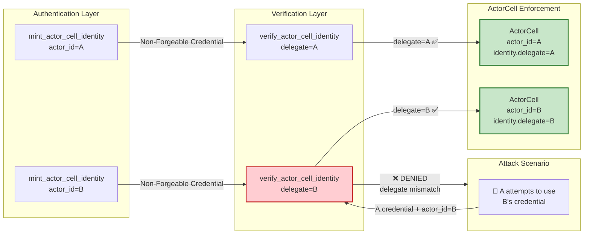

---

## Knowledge Graph Isolation

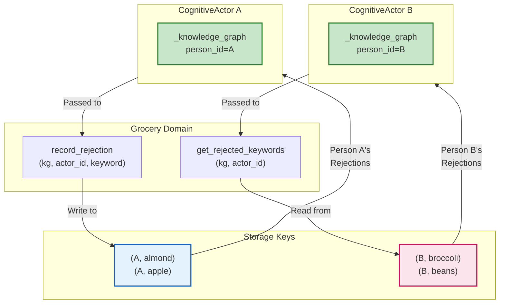

---

## Memory Isolation — Tuple-Keyed

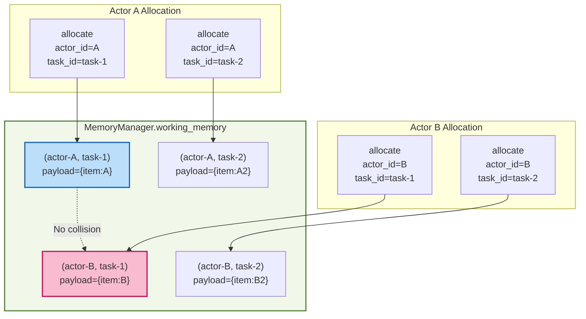

---

## ROS Binding — Actor-Specific

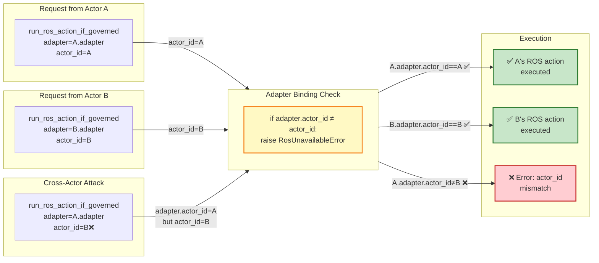

---

## Crash Isolation — Independent Tick Cycles

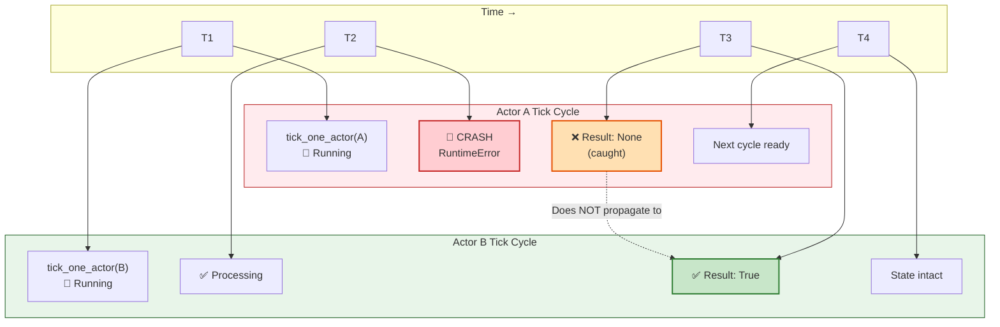

---

## Actor Runtime State Isolation

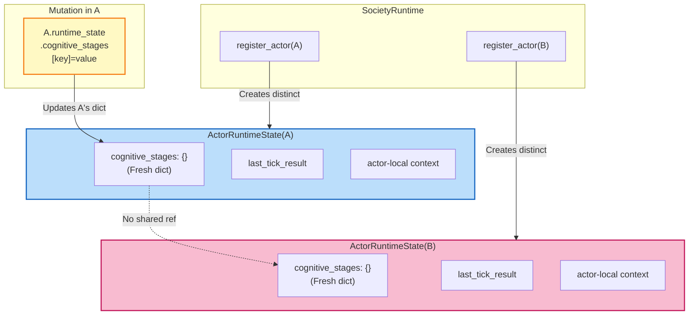

---

## Cloud Boundary — Shared Authority

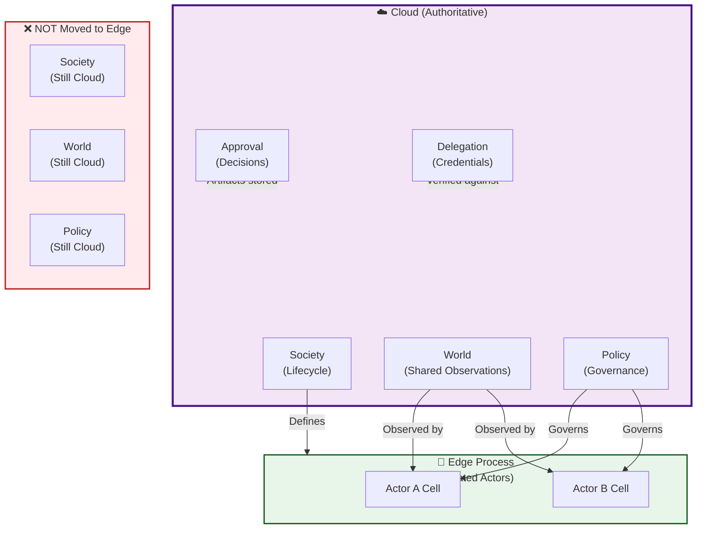

---

## Construction Paths — Both Create Isolated Cells

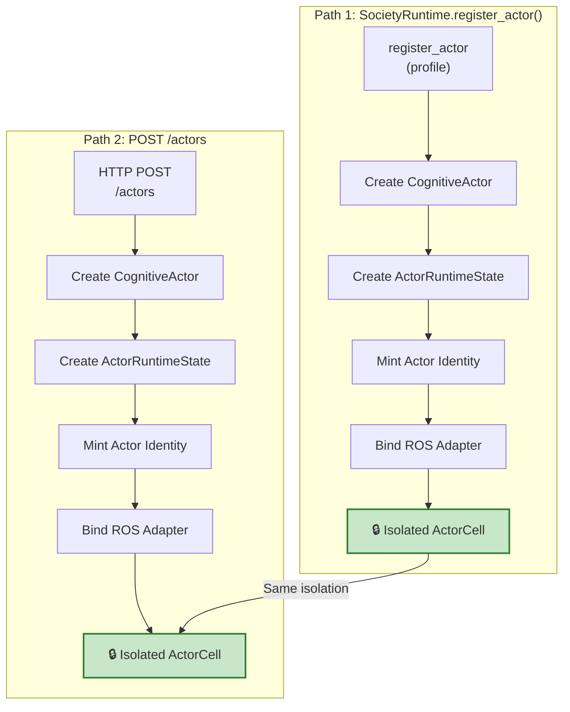

---

## Execution Path — Per-Actor Authorization

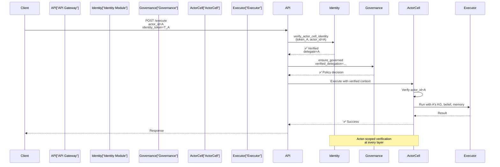

---

## Test Coverage Matrix

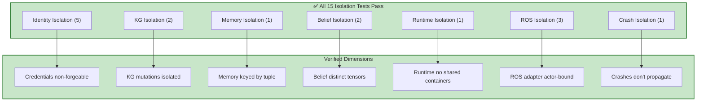

---

## Architectural Principles

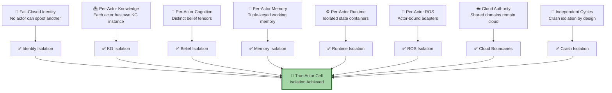

---

## Verdict: Actor Isolation Is Secure

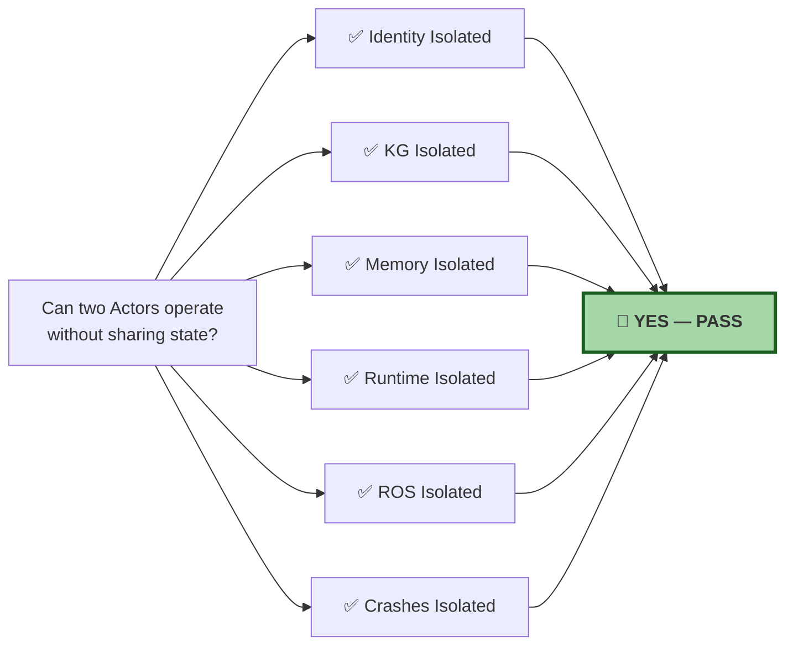

