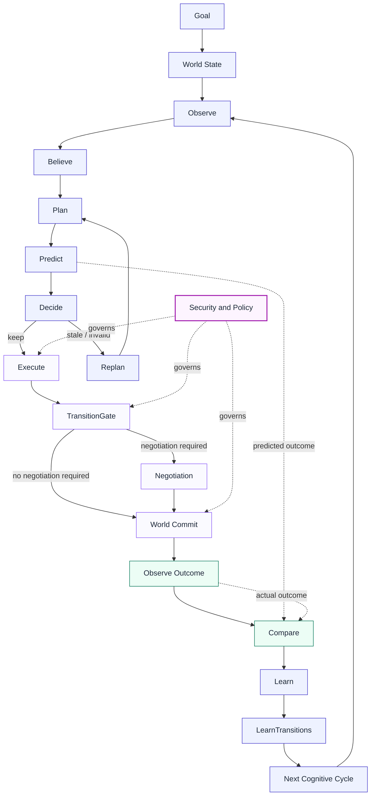

# MonkeyBrain — CognitiveOS

Most agent systems build agents that can call tools. Monkeypatched
builds the operating system that lets autonomous actors exist inside a
changing world — entities that continuously ground their decisions in
the world's current state, act on it, update both their own local
state and the shared global state as a result, and learn from what
actually happens.

That's what sets CognitiveOS apart: it's a persistent, per-actor
cognitive runtime, not a stateless request/response tool-caller. Each
actor carries its own beliefs, memory, goals, and execution history
forward inside a shared, persistent world, across every tick, rather
than reconstructing them from scratch on every call. See
[Feature Set](#feature-set) below for what that means concretely, and
[Architecture](docs/architecture.md) for how it's actually built.

CognitiveOS manages intelligence as a governed runtime resource, separating:

* Kernel → preserves invariants and governance
* Runtime → performs cognition
* Agents → reason and act
* Capabilities → normalized executable resources
* Providers → integrate external ecosystems
* World Model → represents current reality
* Simulation / Prediction → proposes expected consequences
* Reality → verifies those expectations
* Learning loops → correct specific forms of drift
* Cognitive Mesh → connects independently adapting subsystems
* Knowledge Packs / SittingFace → package and version domain knowledge

That decomposition is explicitly summarized in the final architectural principles.


## How It Works


*Condensed from the CognitiveOS paper's Abstract and §1–3. Full text
available on request; this is the summary.*

Most agent systems ask a model to plan, execute, and recover from
failure all at once — conflating cognition with state management. That
conflation is the actual reliability bottleneck, not weak prompts or
missing tools. CognitiveOS separates the two: models and agents
**propose**; the operating system **owns and governs** state — the
full lifecycle of planning, execution, observation, evaluation,
learning, persistence, and recovery.

**Core Principle**: an intelligent actor isn't defined by its ability
to act on the world, but by its ability to *change as a consequence*
of acting on it. Action is simultaneously a goal attempt, a world
intervention, an experiment, and evidence for future cognition — which
is why prediction, execution, observation, and comparison must be
explicit, connected stages, not implicit steps folded into a single
model call.

### Actors, Society, and Trust

An **Actor** is anything — human, robot, software agent, business
process — that observes, decides, acts, and is changed by the
consequences. Coordination between actors runs on a small set of
invariants: every actor is strictly autonomous and owns its local
belief state exclusively; actors communicate only via natural-language
messages, never direct state mutation; the global world state updates
only through Planetary Cycles; negotiation is LLM-driven, not
hardcoded, and fully traced.

Every actor has **Presence** — occupancy of a Space in a hierarchical
location graph (`Planet → Country → City → Space`, extensible without
touching actor cognition). Entering a Space temporarily enrolls the
actor in every **Society** governing that Space; leaving revokes it
automatically. A Society is a governance boundary, not just a
coordination group — it answers three distinct classes of question:

- **Inside the actor (cognition)**: what do I believe, want, and plan?
- **At the society boundary (governance)**: am I allowed to do this,
  does it conflict, does it satisfy policy?
- **Beyond the boundary (reality)**: what actually happens?

**Affiliation** and **Trust** are deliberately separate graphs.
Affiliation is structural (which team/society/org an actor belongs
to) and changes rarely. Trust is dynamic — it's built from outcomes
(`Interaction → Outcome → Evidence → Trust Update → Future Decision`)
and shapes how much weight an actor's claims get, not whether they're
allowed to participate.

### Negotiation

When actors' intended actions conflict or contend for a shared
resource, CognitiveOS frames resolution as a game — actors, strategies,
constraints, utilities, beliefs, information, and outcomes — evaluated
for stability (Nash equilibrium), not fairness. Negotiation resolves to
one of: **cooperation**, **prioritization**, **trade-off**,
**delegation**, **deferral**, or **escalation** to a human/higher
authority. Five invariants hold regardless of strategy: actors never
mutate another actor's state directly; all messages route through the
Society Communication Fabric, never peer-to-peer; society policy
bounds what can be proposed at all; commitments are enforceable and
auditable; and negotiated outcomes execute strictly within governance.

### Planetary Runtime

The Planetary Runtime is coordination infrastructure, not a
cognition — the antidote to the "monolithic super-agent" failure mode.
It only discovers participants, routes messages, manages coordination
sessions and transaction state, propagates events, streams traces, and
schedules delivery. It never reasons, negotiates, or decides on an
actor's behalf — that stays with the actor.

### Global World State

Environmental knowledge splits into two categories: the **Global World
State** (exogenous — what's objectively true, the shared reconciled
baseline) and each actor's **Local Belief Graph** (endogenous — what
that actor knows or remembers). A **World Perturbation** (a machine
failing, inventory changing, an actor moving) is an *input* to
reconciliation, not truth by itself:

```
World State(t) + World Perturbation → World State(t+1)
```

A **Planetary Tick** consumes pending perturbations, reconciles them,
updates the Global World State, identifies affected actors/societies,
propagates the change, and triggers cognitive activity only for actors
it's actually relevant to. Critically, world change and belief change
are different operations — the runtime never overwrites an actor's
beliefs directly; it propagates the change and lets each actor decide
what it means for them.

### SittingFace & Prompt Compilation

**SittingFace** is CognitiveOS's retrieval layer (RAG over
conversations, experiences, execution traces, org knowledge, policy) —
it supplies context, it doesn't hold world truth. Before every LLM
call, the runtime compiles a prompt from three tiers rather than a
growing transcript: (1) persistent stores — Local Belief Graph +
SittingFace, (2) the actor's private, high-frequency Context Stream,
(3) Global World State grounding. Because prompts are assembled
deterministically from persistent storage, an interrupted actor can
reconstruct its full working context rather than losing it with the
conversation window.

### The Closed Cognitive Runtime

The per-tick loop this all resolves to:

```
Plan → Predict → Execute → Observe → Compare → Learn → Persist
```

Predict is a genuine blind forecast made *before* execution, against
the pre-execution state — never a look back at what already happened.
The **Comparator** is an explicit evidence boundary between what was
predicted and what actually occurred: success, failure, partial
outcome, and "insufficient evidence" are distinct states, not
collapsed into one binary. Learning consumes comparator evidence, not
raw execution status — an unexecuted step is never misread as a
failure. Execution state persists and survives interruption, so the
system reconstructs from durable state rather than replaying a prompt
transcript.




### Learning: How the System Scores Itself and Updates Its Beliefs

Compare, Learn, and LearnTransitions in the diagram above are two real
pieces of code that run every tick — 

**Compare — grading the prediction against what really happened**

Every tick, after an action runs, the Comparator checks the Predict
stage's forecast against what actually happened — did the plan run in
the shape expected, did the world end up in the state expected, were
the right events and artifacts produced, was the reward what was
expected. Each of those checks produces a 0–1 similarity score, and
they're combined into a few numbers that describe how wrong the
system was:

```python
comparison_score = round(
    max(0.0, 1.0 - (
        ((1.0 - graph_diff["score"])           * 0.227)
        + ((1.0 - execution_order_diff["score"]) * 0.136)
        + ((1.0 - state_diff["score"])           * 0.182)
        + ((1.0 - operation_diff["score"])       * 0.091)
        + ((1.0 - event_diff["score"])           * 0.091)
        + ((1.0 - artifact_diff["score"])        * 0.091)
        + (latency_diff                          * 0.0)
        + (reward_diff                           * 0.091)
        + (confidence_diff                       * 0.091)
    )), 4,
)

topology_loss  = round(1.0 - ((graph_diff["score"] * 0.5) + (execution_order_diff["score"] * 0.5)), 4)
epistemic_loss = round(1.0 - ((state_diff["score"] * 0.4) + (operation_diff["score"] * 0.2)
                               + (event_diff["score"] * 0.2) + ((1.0 - confidence_diff) * 0.2)), 4)
world_loss     = round(min(1.0, topology_loss + epistemic_loss), 4)
policy_loss    = round(reward_diff, 4)
actor_loss     = round(min(1.0, world_loss * 0.7 + policy_loss * 0.3), 4)
```

`latency_diff`, `reward_diff`, and `confidence_diff` are each just
"how far off was I" as a fraction: `|expected − observed| / max(|expected|,
|observed|, 1.0)`, capped at 1. In plain terms:

- **`topology_loss`** — did the plan execute in the shape predicted?
- **`epistemic_loss`** — was the system right about what state the
  world would end up in?
- **`world_loss`** — the two above, combined.
- **`policy_loss`** — how wrong was the expected reward?
- **`actor_loss`** — the actor's overall miss for this tick: mostly
  how wrong it was about the world (70%), partly how wrong it was
  about the reward (30%).

All of these are losses — 0 means "predicted it perfectly," 1 means
"completely wrong."


### World Perturbations and Deja Vu

The world doesn't hold still between ticks — and when it changes out
from under an actor's plan, the actor gets a chance to notice and
rethink before acting on stale reasoning.

**World perturbations — the world drifts and throws surprises on its
own** . How big the drift is and how likely an event is both scale
with how much has been happening lately — busier, more severe recent
activity means bigger swings.  an actor's plan is never reasoning about
a frozen world, and Predict's forecast and Execute's real outcome can
genuinely diverge — which is exactly what the Compare stage above is
there to measure.


**Deja Vu — replaying an actor's reasoning when its plan gets
invalidated** 

Deja Vu answers one question: "did any actor's standing plan depend on
something that just changed?" For every actor with a saved plan for a
goal, it checks whether any of the perturbed entity IDs appear
anywhere in that plan — if so, the actor's reasoning gets replayed
from scratch under the now-current world state, toward the same goal,
using the same planner and context-assembly a normal tick already
uses. 

Deliberately, Deja Vu never re-executes anything — it only re-decides
whether the old REASONING is still valid. Re-running Execute here
could double-place a real action (like a duplicate order) that the
original plan already carried out; replaying just the reasoning avoids
that while still catching a plan that's now chasing a world that no
longer exists.

### Society and Governance

An actor deciding to do something and an actor being *allowed* to do
it are two separate checks, and CognitiveOS keeps them separate in
code, not just in the conceptual model described earlier. Three real
things enforce this, at three different points in the request/tick
lifecycle.

**The TransitionGate — the last check before shared state changes**

Before a proposed action is allowed to commit, the gate checks the
resources it touches for three things, in order:

1. **A real, incompatible constraint** — the resource declares
   something the proposed transition directly conflicts with. This
   pauses the action and requires negotiation.
2. **An explicit consent requirement** — the resource (or the
   capability itself) names another actor whose consent is needed
   first. Also pauses for negotiation, naming that actor as the
   counterparty.
3. **A live claim from another actor, with neither of the above** —
   this is allowed to proceed without pausing (it's arbitrated by the
   existing reservation mechanism, not by negotiation), but it's still
   recorded as contention so the trace is honest about who else had a
   claim visible at the time.

Only case 1 and 2 actually block; case 3 is pure observability. If
none apply, the action proceeds. This is what turns "two actors want
the same thing" (see [Example: Buying Groceries](#example-buying-groceries)
below) into either a clean pass-through or a real negotiation, instead
of a race.

CognitiveOS uses Open Policy Agent (OPA) to enforce policies at three different points in the system rather than relying on a single central governance layer.

Request governance
Policies are checked when an actor requests planning, execution, prediction, or information from the system.
Actor management
Policies are checked when actors are created, modified, or otherwise managed. This ensures that only authorised actors can perform those operations.
Goal execution
Policies are checked again immediately before a goal is executed. This provides a final safety boundary between deciding what to do and actually doing it.

These checks are intentionally independent. Different operations can therefore have different policies and different levels of enforcement.

The system also distinguishes between configuration and enforcement. At the general request level, if OPA has not been configured, the system can continue operating rather than becoming inaccessible. For actual goal execution, however, once policy enforcement is enabled, the absence or unavailability of OPA results in the action being denied.

When OPA is available, the policies themselves default to deny. An operation must therefore explicitly satisfy the relevant policy before it is allowed.

In simple terms: OPA is not a single gate at the centre of the system. Policy is checked at multiple points throughout the actor lifecycle, with the strongest check placed immediately before an action is executed.


Delegation — allowing one actor to act with another actor’s permissions, deliberately and temporarily

CognitiveOS allows one actor to delegate specific permissions to another actor. Delegation can be limited in scope and duration, and it can be revoked at any time.

Every delegation and revocation is recorded as part of an immutable history. This means the system can show not only who currently has a permission, but also who granted it, when it was granted, when it was revoked, and what permissions were delegated.

When an actor makes a request, the system considers both:

the permissions the actor has directly, and
any permissions that have been delegated to them.

The result is the actor’s effective permissions for that request.

There is no separate impersonation mechanism. The delegated permissions go through the same authorisation process as the actor’s own permissions.

In simple terms: delegation lets one actor temporarily give another actor specific authority to act on their behalf, while keeping that authority explicit, revocable, and fully auditable.


## Example: Buying Groceries

The reference domain shipped with CognitiveOS is grocery commerce
(`kernel/domains/grocery.py`) — chosen precisely because "buy milk" is
simple enough to follow end to end while still exercising every layer
above: grounding, planning, gated execution, negotiation, and
learning. This walks through what actually happens, at each layer,
using the same seeded demo actor (Priya Sharma) the
[Install & Run guide](docs/install-and-run.md) has you run yourself.

### One actor, the world, and a single request

Priya asks: *"Buy 2 liters of milk."* Her actor doesn't treat that as
a one-shot function call — it runs the full loop:

1. **Observe / Believe** — her cognitive tick grounds against the
   real Knowledge Graph: which stores carry milk, current price,
   current stock, her existing beliefs and standing goals.
2. **Plan** — the LLM planner produces a concrete step sequence:
   `ProductSelection → OrderCreation → PaymentConfirmation → Payment →
   OrderConfirmation → Delivery`.
3. **Predict** — before anything executes, the runtime forecasts the
   expected outcome of that plan against the *pre-execution* world
   state — a real forecast, not a look back at what already happened.
4. **Decide** — accepts the fresh plan (or, on a later request, keeps
   the standing plan for this goal if nothing about the world has
   invalidated it).
5. **Execute** — each step runs in order. `OrderCreation` doesn't just
   write an order — it proposes a transition through **TransitionGate**
   first: the actual inventory reservation (`try_reserve`) only
   commits if the gate clears it. `Payment` debits Priya's wallet the
   same way — proposed, gated, then committed, never the reverse.
6. **Observe Outcome / Compare** — the real result (order created,
   payment captured, 1 fewer unit of milk in stock) is compared
   against what was predicted in step 3.
7. **Learn** — the comparison updates Priya's learned model of this
   specific action (`ProductSelection` → milk, this store), so a
   future prediction for the same kind of purchase is better
   calibrated, and updates the shared PolicyStore's Q-value for that
   (goal, action) pair.

Nothing here is scripted per-request. The same loop runs whether Priya
asks for milk, eggs, bread, or ground coffee — only the plan the LLM
produces differs.

### Two actors, one contended resource

Now suppose Priya and another actor both try to buy the **last unit**
of the same product at close to the same time . Neither
actor's local belief knows about the other's in-flight purchase — they
only find out through the gate:

- Both proposals reach  . Whichever proposal
  the gate processes first sees the reservation succeed and commits.
- The second proposal's inventory read now reflects the first
  actor's live claim the gate never lets a second
  buyer commit against stock that's already spoken for.
- If the two actors' claims are for genuinely *incompatible* resources
  under a declared constraint (not just a stock race), the gate pauses
  the losing action for negotiation instead of silently failing it —
  holds it open until it's accepted or rejected,
  and only an accepted negotiation resumes into a real commit.

The world is never oversold and never double-committed — one of those
two proposals either loses the race honestly, or gets a real
negotiation, never both succeeding against the same unit.

### Actors sharing a resource on purpose

Contention isn't always a race — sometimes actors are *meant* to share.
A household budget works the opposite way from the contention case: 
Priya and a family member spending against
the same budget don't need to negotiate every purchase — the budget
tracks cross-actor accounting, reserves against the ceiling per
purchase, and reconciles on completion or failure, so two genuinely
compatible spends both commit with no artificial negotiation, 
while a spend that would actually break the shared
ceiling still gets caught the same way stock contention does.

This is the same TransitionGate mechanism the diagram above shows —
what differs is only what the proposed transition touches: exclusive
stock triggers contention, a shared budget's own accounting doesn't,
and the gate is what tells the two cases apart before either commits.

## Feature Set

Current architecture and qualification status — consolidated
implementation inventory for the open-source (AGPL) edition.

### Cognitive Core

- Natural-language intent ingestion
- Intent → Goal transformation
- World-grounded planning
- Execution graph generation
- Plan validation
- Dependency reasoning
- Ordered execution
- Independent action decomposition
- Constraint-aware planning
- Priority-aware planning
- Preference-aware planning
- Prediction before execution
- Observe → Compare → Learn loop
- Belief update
- Replanning after world change

### World Model & Grounding

- Persistent world representation
- Current world-state grounding
- Entity resolution
- Capability grounding
- Provider grounding
- Availability reasoning
- Inventory reasoning
- World mutation handling
- Stale-state detection
- World-state validation
- World-change observation
- Belief/world consistency checking

### Execution Runtime

- CognitiveRuntime
- Plan / Observe / Act / Learn loop
- Execution Graph
- Execution state tracking
- Execution node dependencies
- Action dispatch
- Capability discovery
- Capability execution
- Execution result handling
- Execution provenance
- Correlation tracking
- Causation tracking
- Generic recovery contract
- Retry execution
- Same-tick recovery
- Partial-failure handling
- Dependency-failure handling

### Domain Isolation

- Dependency injection
- One-way capability registration seam
- Domain capabilities register into CognitiveOS
- No OS imports of grocery implementations
- ActionExecutor does not inspect domain parameters
- Domain parameters remain opaque to OS runtime
- Domain-specific recovery remains in capabilities
- Non-grocery domain compatibility
- Fictional machine domain verified
- Fictional robotics domain verified
- Static OS/domain boundary guard
- Behavioral domain-isolation tests
- 13/13 isolation tests passing
- 84/84 deterministic regression tests passing

### Failure & Recovery

- Deterministic fault injection
- Provider failure detection
- Capability failure detection
- Failure propagation
- Failure comparison
- Recoverable failure classification
- Generic retry
- Alternative-provider recovery
- Same-tick recovery
- Partial recovery
- No duplicate successful actions
- Recovery provenance
- Recovery boundedness
- Safe generic fallback

### Human-in-the-Loop

- Human approval requirement
- Approval boundary
- WAITING_FOR_HUMAN state
- Persistent pending approval
- Human approval
- Human rejection
- Resume original execution
- Approval survives restart
- No unauthorized action during pause
- No duplicate action after resume
- Live HTTP E2E verification

### Persistence & Checkpointing

- Execution checkpoints
- Persistent execution state
- Runtime restart recovery
- Pending execution restoration
- Completed-node preservation
- Pending-node preservation
- Resume from checkpoint
- Duplicate-action prevention
- Checkpoint goal preservation
- Original request preservation
- Live checkpoint/resume verification

### Multi-Agent Runtime

- Multiple cognitive actors
- Actor identity
- Actor-specific execution state
- Actor isolation
- Concurrent actors
- Conflicting beliefs/observations
- Shared goals
- Delegation
- AskActor
- Delegated execution
- Delegated result propagation
- Delegation fallback
- Negotiation
- Actor-to-actor coordination
- Correlated delegated transactions
- Causation/provenance

### Shared Resources

- Shared resource representation
- Shared budget
- Cross-actor budget accounting
- Budget reservation
- Budget reconciliation
- Concurrent budget enforcement
- Failed-transaction budget recovery
- Shared constraint enforcement
- Live shared-budget verification

### Learning

- Prediction
- Execution outcome capture
- Expected vs actual comparison
- Comparator
- Learning evidence generation
- Success learning
- Failure learning
- Provider performance learning
- Persistent learned state
- Cross-execution learning
- Learning inspection
- Learning from actual outcomes
- Historical evidence preservation

### Policy & Governance

- Policy enforcement
- Runtime policy
- Security policy
- Learning policy
- Fraud-review gate
- Fraud-risk evaluation
- Velocity/cooldown visibility
- Permission enforcement
- Communication permissions
- Policy-aware execution
- Security controls preserved during qualification
- No policy bypass

### Security

- Identity
- Authorization
- Delegation
- Consent
- Revocation
- Private cognition
- Pre-commit security
- Negotiation-before-commit
- TransitionGate
- World commit authorization
- Mutation protection
- Execution audit
- Actor attribution
- Policy audit
- Consent audit
- Negotiation audit
- Transition audit
- Capability audit
- Security audit
- Security monitoring
- Security violation detection
- Cross-actor access monitoring
- Security dashboard

### Trust, Membership & Society

- Society model
- Actor membership
- Actor Registry
- Agent Registry
- Capability Registry
- Provider Registry
- Membership scoping
- Membership revocation
- Shared World
- Trust network
- Affiliation Graph
- Governance
- Policy registry
- Society-level capabilities
- Society administration
- Trust relationships
- Actor affiliation
- Provider affiliation
- Trust-aware discovery

### Agents & Communication

- Agent model
- Agent identity
- Agent registry
- BrocaAgentRegistry
- Agent discovery
- AgentBus
- Agent routing
- Actor-to-agent communication
- Agent-to-agent communication
- Sender attribution
- Receiver attribution
- Conversation history
- Communication isolation
- Conversation security
- Agent authorization

### Capabilities

- Capability model
- CapabilityRegistry
- Capability discovery
- CapabilityBus
- Capability routing
- Capability execution
- Capability/provider separation
- Capability authorization
- Capability scope
- Capability security
- Capability observability
- Capability → provider routing

### Providers

- Provider model
- ProviderRegistry
- Provider discovery
- ARD discovery
- Local registry discovery
- OpenClaw provider
- N8n provider
- NANDA fallback
- Provider selection
- Provider → capability mapping
- Provider execution
- Provider health
- Provider observability
- Provider security/policy
- Provider admin UI

### Negotiation

- Negotiation model
- NegotiationPlanner
- TransactionCoordinator
- PendingNegotiation
- Contention detection
- Counterparty identification
- Negotiation lifecycle
- Accept/reject
- Negotiation state
- Negotiation isolation
- Negotiation before commit
- Negotiation → TransitionGate
- Negotiation admin UI
- Negotiation trace

### Commerce / Reference Grocery Domain

- Product selection
- Provider selection
- Order creation
- Payment confirmation
- Payment
- Order confirmation
- Delivery
- End-to-end transaction
- Real-world inventory
- Real-world availability
- Real execution state
- Wallet
- Actor orders
- Actor preferences
- Order → execution linkage
- Order → security linkage
- Order → negotiation linkage

### Edge / Cloud Deployment

- Edge CognitiveOS
- Cloud CognitiveOS services
- Per-actor process
- Per-actor PID/log
- Edge startup
- Edge shutdown
- Edge actor deployment
- Kubernetes deployment
- Actor-specific pods
- Shared Society infrastructure
- Edge → Cloud sync
- Actor-specific state
- Deployment scripts
- Actor deployment observability
- Durable production recovery
- Large-scale load qualification

### Observability & Admin Console

- Lemon metrics
- Runtime metrics
- Execution metrics
- Pipeline metrics
- Actor monitoring
- World monitoring
- Security monitoring
- Execution trace
- Debugger
- Plan Analyzer
- Context visualization
- Grounding visualization
- Audit visualization
- Provider monitoring
- Dashboard
- Actors
- Societies
- World Map
- Timeline
- Negotiations
- Knowledge Graph
- Grounding Graph
- Context Stream
- Memories
- Affiliations
- Capabilities
- Providers
- Communication
- Security
- Orders & Wallet
- Settings

### Verification & Qualification

- Unit test triage
- Integration — 85/85
- Deterministic solvers — 61/61
- Qualification regression — 10/10
- Actor isolation — 10/10
- State-transition gate — 8/8
- Milk E2E with strict ordering
- Frontend qualification
- Security qualification
- Deployment verification
- Provider tests
- Negotiation tests
- Remaining infra-timing qualification
- Remaining architecture/constitution cleanup

### Benchmark Scenarios

- MB-0001 Hello World / Milk — PASS
- MB-0002 Multi-Agent shared budget — PASS
- MB-0003 Provider Discovery — PASS
- MB-0004 Budget Constraint — PASS
- MB-0005 Priority Constraint — PASS
- MB-0006 Reservation — PASS
- MB-0008 Interruption — PASS
- MB-0009 Temporal reasoning — PASS
- MB-0010 Negotiation — PASS
- MB-0011 Belief vs Reality — PASS
- MB-0012 Human approval — PASS
- MB-0013 Long-running plan — PASS
- MB-0014 Partial failure — PASS
- MB-0015 Learning — PASS

### Completion by Domain

| Domain | Completion |
|---|---|
| CognitiveOS runtime | 98% |
| Cognitive loop | 97% |
| World model | 95% |
| Memory / beliefs | 97% |
| Agents | 95% |
| Capabilities | 95% |
| Providers | 95% |
| Society | 95% |
| Trust / affiliations | 95% |
| Negotiation | 95% |
| Governance | 95% |
| Security | 100% — qualified |
| Commerce | 95% |
| Edge/cloud | 90% |
| Observability | 95% |
| Admin frontend | 95% |
| Testing / qualification | 90% |
| Production hardening | 80–85% |
| **Overall** | **94–95%** |

## Install & Run

```bash
git clone https://github.com/monkeypatched-stack/cogitive-os.git
cd cogitive-os
docker compose up agentos
curl http://localhost:8031/live
```

That's Docker Compose; for a native install against your own
MongoDB/Redis/Neo4j, prerequisites, verifying the boot actually
succeeded, and your first real request — see
**[`docs/install-and-run.md`](docs/install-and-run.md)**.

## License

Copyright (C) 2026 Prashun Javeri. See [`NOTICE`](NOTICE) for the full
copyright/license notice.

CognitiveOS is fully open source under the
[GNU Affero General Public License v3.0 or later](LICENSE)
(AGPL-3.0-or-later). Free to use, modify, and self-host. If you modify
this software and make it available to users over a network, AGPLv3
requires you to make your complete modified source available to those
users under the same license. There is no restricted "Enterprise
Edition" — see [Commercial Services](#cognitiveos-commercial-services)
below for what Monkeypatched offers alongside the open-source runtime.

## CognitiveOS Commercial Services

CognitiveOS is fully open source under the GNU Affero General Public
License v3.0 or later (AGPL-3.0-or-later).

Monkeypatched does not restrict access to the CognitiveOS cognitive
runtime in order to create a paid "Enterprise Edition".

Instead, Monkeypatched provides optional commercial services for
organizations that need CognitiveOS adapted to their own environment.

### Enterprise World Integration

Organizations can engage Monkeypatched to connect CognitiveOS to their
specific enterprise world.

This may include:

#### Ontology

- Enterprise ontology design
- Entity and relationship modeling
- Ontology mapping
- Domain-specific semantics
- Ontology evolution

#### Data Integration

- ERP systems
- CRM systems
- WMS systems
- Databases
- Internal APIs
- Event streams
- Existing enterprise platforms

#### Capabilities

- Enterprise-specific capabilities
- Provider integrations
- Internal tools
- Domain-specific execution interfaces

#### Deployment

- Cloud deployment
- Edge deployment
- On-premises deployment
- Private infrastructure
- Production integration

#### Security and Governance

- Enterprise identity integration
- Authorization integration
- Policy integration
- Governance configuration
- Audit integration

#### Ongoing Services

- Ontology maintenance
- Integration maintenance
- Custom engineering
- Production support
- Architecture assistance
- Upgrades and migration

### Important Licensing Boundary

Commercial services are separate from the CognitiveOS open-source
license.

The CognitiveOS source code remains available under AGPL-3.0-or-later.

Purchasing commercial services does not remove the customer's rights
under the AGPL.

Likewise, using CognitiveOS under the AGPL does not create an
obligation to purchase commercial services from Monkeypatched.

Specific commercial services, deliverables, support commitments,
warranties, liability provisions, pricing, and other contractual terms
are defined separately in customer agreements.

This document is a description of the commercial model and is not a
commercial services agreement.

### LLM Costs

Customers may incur separate costs for LLM/API usage from their chosen
model providers. Such costs are independent of CognitiveOS licensing
and Monkeypatched professional-services fees.

## Documentation

- [Install & Run](docs/install-and-run.md) — clone, install (Docker
  Compose or native), boot, verify, and your first real request.
- [Architecture](docs/architecture.md) — layering, geography/society
  split, world/policy split, timelines, and how it all actually fits
  together, as verified live across Gates 3-9.
- [OpenAPI spec](docs/openapi.md) — live and frozen spec, 337 paths /
  384 operations (snapshot as of 2026-08-26; the live endpoint is
  always the current count).
- [Examples](docs/examples.md) — real request/response pairs, captured
  live, not hand-written.
- [Deployment guide](docs/deployment.md) — Docker Compose, Kubernetes,
  Helm.
- [Troubleshooting guide](docs/troubleshooting.md) — real issues hit
  and diagnosed during this build.
- [Architecture Decision Records](docs/adr/) — the full decision record
  for Gates 3 through 11 (006-018).
