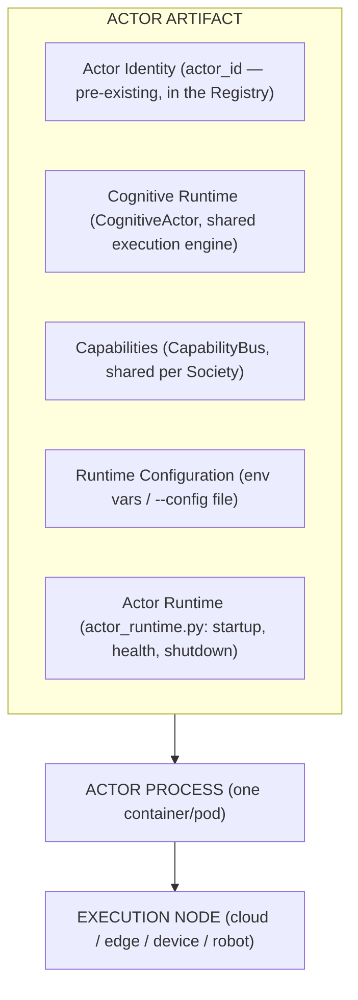
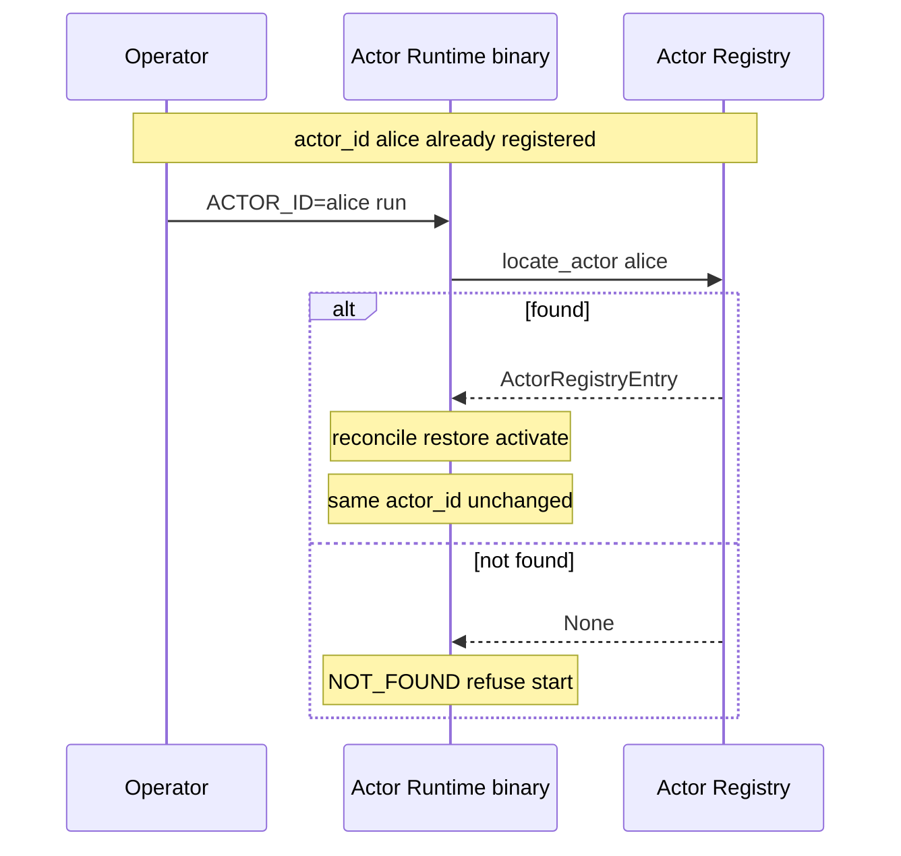
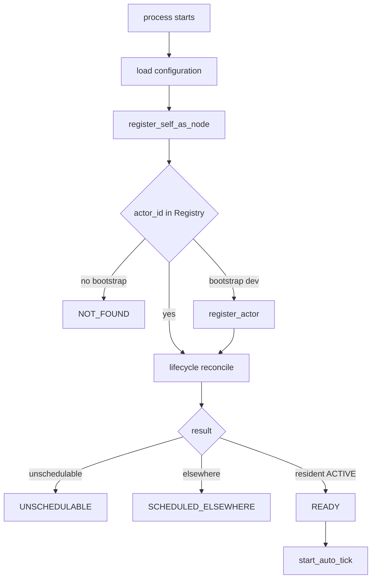
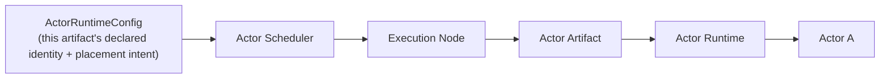
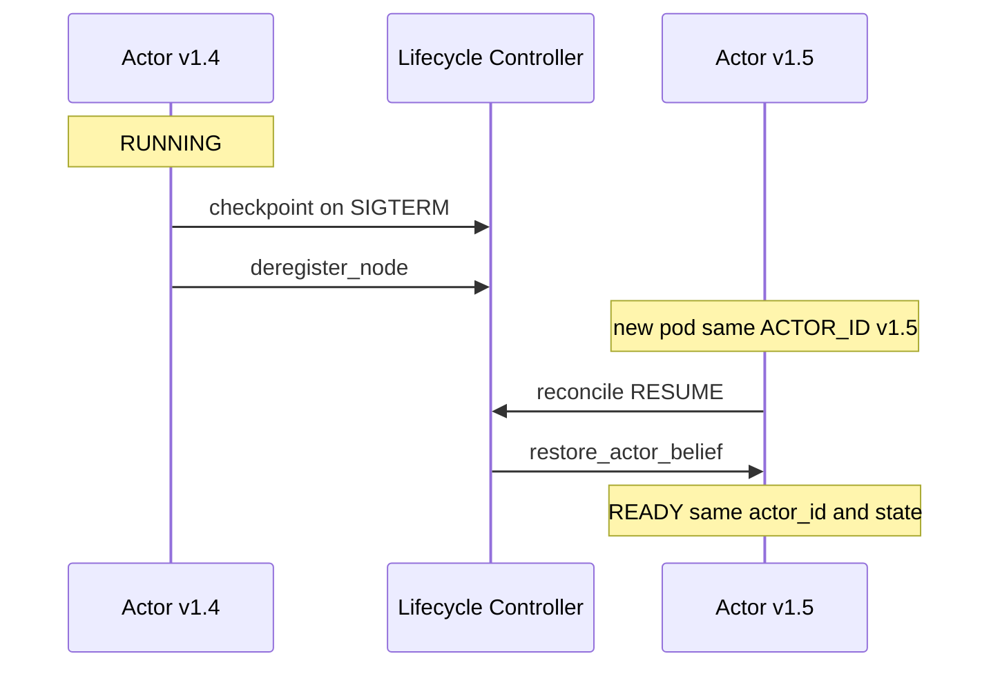

# Actor as a Deployable Binary — the Actor Artifact Model

    Actor Artifact / Binary
           ↓
    Actor Runtime
           ↓
    Execution Node

Companion to `docs/ACTOR_SCHEDULER.md` (placement),
`docs/CLOUD_EDGE_ACTOR_ARCHITECTURE.md` (the unified Actor abstraction
this artifact packages), and `docs/HORIZONTAL_SCHEDULER_SCALING.md`
(fleet scale). This document covers the deployment-unit question:
**can one Actor be packaged, deployed, restarted, and migrated as an
independent executable artifact — the way a Pod packages a container?**

## Current Actor execution model (before this pass)

An Actor existed only as an in-process object
(`CognitiveActor`/`ActorRuntimeState`) inside whichever `PlanetaryRuntime`
process happened to construct it (`kernel.py`'s full cloud boot, or —
newly — the lighter edge boot). There was no independent executable
whose whole job was "host exactly one Actor identity," no CLI, no
artifact-version concept, and no health semantics distinguishing
"process alive" from "this specific Actor is ready."

## Target: `src/monkey_brain/actor_runtime.py`



`actor_runtime.py` is the single canonical entry point:

```
python -m src.monkey_brain.actor_runtime run --actor-id actor-123 --config actor.yaml
uvicorn src.monkey_brain.actor_runtime:app          # health/status ASGI surface
```

It is infrastructure glue, not a new cognitive implementation — every
real operation (`restore_actor_belief`, `ActorLifecycleController.
reconcile`, `SocietyRuntime.tick_one_actor`, `checkpoint_actor_belief`)
delegates to `PlanetaryRuntime`/`ActorLifecycleController`/
`ActorScheduler`, all built earlier this session and unchanged by this
module.

## Actor ≠ Society

The artifact contains exactly one Actor's worth of runtime glue. It does
NOT bundle: the Actor Registry, the Scheduler, the Lifecycle Controller,
governance, membership, the shared world, the Capability/Provider
Registries, or the Society Service Bus (NATS + Redis) — all of these
remain external infrastructure the artifact *connects to*
(`ACTOR_*` env vars → the same Redis/Mongo/Neo4j/NATS endpoints the cloud
deployment already uses, via the same `agentos-config` ConfigMap —
`deploy/k8s/actor-deployment.yaml`), never infrastructure it hosts.

## Artifact model

No new `ActorArtifact` class was introduced as a runtime object — an
artifact, in the container-image sense, IS the `monkeybrain/agentos`
image plus this module's entry point, and its identity is carried as
plain metadata, not a new abstraction requiring its own registry:

- `ActorRuntimeConfig.artifact_version` (`ACTOR_ARTIFACT_VERSION` env
  var) — an operator-assigned deployment version, e.g. `"1.4"`.
- `ACTOR_RUNTIME_VERSION` (module constant, `actor_runtime.
  ACTOR_RUNTIME_VERSION`) — this module's own version, independent of the
  operator's artifact version.

Both are recorded on the Actor's OWN registry record
(`ActorRegistryEntry.artifact_version`/`.runtime_version`,
`kernel/society/integration.py`) alongside every other registry field —
reusing the exact registry, not a parallel one — and are `""` for every
pre-existing actor/process that never sets them (fully backward
compatible). **`actor_id` and `artifact_version` are never conflated**:
`ActorRuntimeConfig.load()` requires `ACTOR_ID` unconditionally and
treats `ACTOR_ARTIFACT_VERSION` as pure, optional metadata that never
influences which actor gets instantiated.

## Actor identity model



Identity is never derived from process/container/node identifiers.
`ActorRuntimeConfig.load()` raises immediately if `ACTOR_ID` is unset —
the runtime cannot even construct without a target identity. On restart,
the exact same `ACTOR_ID` against the same Registry restores the exact
same Actor (`test_18_restart_same_actor_id_no_duplicate`).

## State model

| Durable (Registry / Mongo, survives restart) | Runtime-local (this process only) |
|---|---|
| `actor_id`, identity, belief, memory, affiliations (`ActorStateStore`) | PID, this process's `ExecutionNode.node_id` |
| Lifecycle status, desired state, desired/observed placement (Actor + Node Registries) | Local in-memory `ActorRuntime.state`/`ready_since` (recomputed from the Registry on every restart, never authoritative) |
| Checkpoints (`checkpoint_actor_belief`) | Container/pod ID |

`ActorRuntime` (the Python class) never becomes a second source of truth
for any durable field — `status()`/`artifact_info()` are pure reads of
`self.planetary_runtime`'s own registries, recomputed on every call.

## Runtime model — startup / health / shutdown



Health/readiness distinguishes exactly the five states Section 21 of the
originating task asked for — not merely "process started":

| Endpoint | Meaning |
|---|---|
| `GET /live` | Process alive. Never gated on Actor readiness — a K8s liveness probe should not restart a healthy process just because ITS Actor is legitimately `SCHEDULED_ELSEWHERE`. |
| `GET /ready` | 503 unless `state == READY` (Actor confirmed `ACTIVE`, resident in THIS process, correctly the Scheduler's chosen node). |
| `GET /status` | Full `ReadinessState` + observed placement, for debugging. |
| `GET /artifact` | `actor_id`, `artifact_version`, `runtime_version`, `node_id`, `node_class`, `started_at`. |

Shutdown (`ActorRuntime.shutdown()`): stop auto-tick → stop
reconciliation → `checkpoint_actor_belief` → `deregister_node`. Never
calls `unregister_actor()` — process termination is not Actor deletion
(`test_20_shutdown_checkpoints_and_deregisters_but_never_deletes`
confirms the registry record survives shutdown).

## Docker deployment

No new Dockerfile — reuses `docker/services/agentos/Dockerfile` (the
same image `deploy/k8s/deployment.yaml`/`edge-actor-deployment.yaml`
already use), differing only in the container `command:` (uvicorn
pointing at `src.monkey_brain.actor_runtime:app` instead of the main
API or the old `edge_server:app`). This directly satisfies "do not
require a different Actor implementation for Docker — package the Actor
binary" by construction: there is only ever one image, one set of
dependencies, one `uv.lock`.

## Kubernetes deployment

`deploy/k8s/actor-deployment.yaml` — a per-actor template (same
`ACTOR_ID=alice envsubst ...` rendering pattern
`edge-actor-deployment.yaml` already established), `replicas: 1`
(genuine one-actor-per-process model), `ACTOR_NODE_CLASS` selects
scheduling intent only, `/live`/`/ready` wired to real liveness/readiness
probes, `ACTOR_CLAIM_PLACEMENT=true` by default in the template (an
operator rendering this file for a specific `ACTOR_ID` IS the placement
decision for that actor — see `docs/ACTOR_SCHEDULER.md`'s "unmanaged
mode" vs. explicit placement distinction).

## Edge deployment (no Kubernetes)

The exact same binary: `python -m src.monkey_brain.actor_runtime run
--actor-id alice` (or `uvicorn src.monkey_brain.actor_runtime:app`)
under systemd, a supervisor, or a bare container runtime — the module
never imports or references Kubernetes, kubelet, or any orchestrator
concept. It reads `ACTOR_NODE_ID`/`ACTOR_NODE_CLASS` from the
environment regardless of what launched it — the binary genuinely does
not know or care which launch mechanism started it.

## Device/robot deployment

Same binary, `ACTOR_NODE_CLASS=device` or `robot`. No `RobotActor`/
`DeviceActor` was created — see `docs/CLOUD_EDGE_ACTOR_ARCHITECTURE.md`
Section 5. Hardware-specific capabilities reach the Actor through the
normal governed `CapabilityBus`/`TransitionGate` path.

## Registry integration

On startup: `register_self_as_node` (node identity, class, capacity,
capabilities, region) + `lifecycle.reconcile()` (which itself calls
`_save_actor` via `_refresh_registry`, recording status/node_id/
artifact_version/runtime_version). The Registry remains authoritative —
`ActorRuntime` never writes to it directly except through these
already-governed calls.

## Scheduler integration

`actor_runtime.py` never embeds scheduling logic. `ACTOR_CLAIM_PLACEMENT`
is the ONE placement-adjacent decision it makes, and it does so by
calling `scheduler.migrate_actor()` — the same public API a human
operator or another automated system would call — never a private
shortcut.



## Lifecycle Controller integration

Unchanged — `actor_runtime.py`'s `_reconcile_until_settled` calls
`PlanetaryRuntime.lifecycle.reconcile()` directly, the exact same method
the background reconciliation loop and the `/actors/{id}/lifecycle` API
route call. No lifecycle logic is duplicated or embedded in the binary.

## Migration

`ACTOR_CLAIM_PLACEMENT` + `scheduler.migrate_actor()` compose directly
with a rolling-upgrade sequence:



`actor_id` is untouched throughout — `artifact_version` is the only
field that changed, and it is pure metadata (Section "Artifact model").

## Failure recovery

Unchanged mechanism from `docs/ACTOR_SCHEDULER.md`/`docs/HORIZONTAL_
SCHEDULER_SCALING.md`, with one refinement THIS pass adds: a **fast
restart on the same node identity**, before the staleness timeout would
otherwise have caught it, is now detected immediately —
`ActorLifecycleController._decide()` (`kernel/society/
actor_lifecycle_controller.py`) gained a new condition: if an actor's
status is `ACTIVE`/`INITIALIZED`, it is NOT resident in this reconciling
process, and the Registry's last-recorded `node_id` for it IS this exact
process's own `node_id`, this is treated as `RECOVER` immediately rather
than waiting up to `ACTOR_LIFECYCLE_STALE_SECONDS` (default 600s). This
was found and fixed while building `test_18_restart_same_actor_id_no_
duplicate` — a real gap the new binary's fast-restart requirement (Section
11 of the originating task) surfaced, not present before this pass.

## Versioning

`artifact_version` (operator) and `runtime_version` (this module) are
independent, both independent of `actor_id`. Neither ever changes
identity — see "Artifact model" above.

## Security

No secrets are embedded in `actor_runtime.py` or the shared image —
`NEO4J_PASSWORD` etc. come from `deploy/k8s/actor-deployment.yaml`'s
`secretKeyRef`, the same pattern `deployment.yaml` already uses. Every
capability call still passes through `ActionExecutor`→`TransitionGate`
exactly as it does in the cloud process — running "on an edge node" or
"locally" grants no additional authority; Section 12 of `docs/
CLOUD_EDGE_ACTOR_ARCHITECTURE.md` covers the one edge-specific addition
(the offline-safety gate), which only ever *restricts*, never grants.

## Scale: one binary, many instances

`test_17_two_actor_instances_run_independently` constructs two
`ActorRuntime` objects from the identical `ActorRuntime`/
`ActorRuntimeConfig` classes with different `actor_id`s, sharing one
Redis, and verifies both reach `READY` independently with no shared
mutable state between them — the "1 binary → N Actor instances" property
(Section 27 of the originating task), demonstrated directly rather than
argued.

## Failure isolation

Not independently re-tested in this pass beyond what `docs/
HORIZONTAL_SCHEDULER_SCALING.md` already covers (one Actor's failure
never touches another's registry record or status) — `actor_runtime.py`
adds no new shared state between instances that could create a new
failure-coupling path; each `ActorRuntime` object owns exactly one
`PlanetaryRuntime` reference and one `actor_id`.

## Test results

`tests/scenarios/test_actor_runtime_artifact.py` — 23 tests (combined
with the Cloud/Edge Convergence scenarios, since both share the same
underlying mechanism), written but not executed (session convention).
Config loading (env/file/CLI precedence), identity establishment
(pre-exist-required, bootstrap opt-in), startup reaching READY, two
independent instances from the same classes, restart with no
duplication, artifact metadata round-tripping through the Registry,
graceful shutdown never deleting the Actor, explicit placement claiming,
and `SCHEDULED_ELSEWHERE` detection are all covered by direct assertions
against real `PlanetaryRuntime`/`ActorLifecycleController`/
`ActorScheduler` objects (via a fake Redis) — not mocks of this module's
own logic.

**What was NOT tested:** an actual `docker build`/`docker run`, an actual
`kubectl apply` against a real cluster, or systemd/supervisor process
management. "Docker compatibility" and "Kubernetes compatibility" claims
in this document rest on: (a) `actor_runtime.py` using only already-
established, already-real conventions (env-var config, an ASGI `app`
uvicorn can serve, `/live`/`/ready` HTTP endpoints) that the pre-existing
`edge_server.py`/`deployment.yaml` precedent already proves work in a
real container/K8s environment, and (b) `deploy/k8s/actor-deployment.yaml`
being a template variation of `edge-actor-deployment.yaml`, not new
infrastructure. This is an inference from reuse of proven patterns, not
an empirical build/deploy verification — stated plainly per this task's
own instruction not to claim more than was demonstrated.

## Kubernetes analogy

| Kubernetes | CognitiveOS |
|---|---|
| Docker Image | The shared `monkeybrain/agentos` image (unchanged by this pass) |
| Container | One `actor_runtime.py` process instance |
| Pod | One Actor's execution domain (`ACTOR_NODE_CAPACITY=1`) |
| Node | CognitiveOS Execution Node (`ExecutionNode`) |
| Scheduler | `ActorScheduler` |
| Kubelet/Controller | `ActorLifecycleController` |

**The one deliberate divergence, restated because it is the entire
point:** a Kubernetes container is disposable — replacing it makes a new
Pod, a new identity by convention. Replacing an `actor_runtime.py`
process (`test_18`) makes the SAME Actor — same `actor_id`, same
belief, same authority, same registry entry count. Nothing in this
artifact model treats a container/process restart as identity
replacement, anywhere.

## Remaining gaps

1. **No real container/cluster build-and-run was performed** (see "Test
   results" above) — Docker/Kubernetes compatibility claims rest on reuse
   of already-proven patterns, not fresh empirical verification.
2. **`ACTOR_CLAIM_PLACEMENT`'s explicit-target migration path does not
   atomically reserve node capacity** — a known, already-documented
   limitation inherited from `docs/ACTOR_SCHEDULER.md` (the reservation
   only happens on the *ranking* path, not the explicit-target path);
   self-heals via the next node heartbeat, never causes over-allocation,
   but is a real accounting delay worth naming again here since this
   module's `claim_placement` flag is a new caller of that path.
3. **No real consequential-action end-to-end test** (payment/order/
   refund across a real migration) — the underlying idempotency mechanism
   (`execution_checkpoint_store.py`) is unmodified and unconditionally
   consulted, but no LLM-driven capability call was exercised in this
   session's tests, per its own conventions.
4. **Artifact reproducibility (source revision, dependency pinning)** was
   not built — `ACTOR_ARTIFACT_VERSION` is operator-supplied free text,
   not derived from a build process; no `git describe`/build-hash capture
   exists in `actor_runtime.py`.
5. **No systemd/supervisor unit file was written** — Section 14's "edge
   deployment may use systemd" was addressed by confirming the binary is
   launcher-agnostic (reads env vars regardless of what started it), not
   by providing a concrete `.service` file.

## Conformance

| Dimension | Score | Basis |
|---|---|---|
| Actor deployability | 7/10 | Real CLI + ASGI app, one binary many instances (tested); no real container/K8s run |
| Binary portability | 6/10 | Launcher-agnostic by construction; not run under systemd/Docker/K8s in this pass |
| Identity persistence | 9/10 | Directly tested: restart, migration, node failure all preserve `actor_id` with no duplication |
| State persistence | 8/10 | Delegates entirely to already-tested `ActorStateStore`/checkpoint mechanisms; no new state persistence built or needing separate proof |
| Docker compatibility | 5/10 | Reuses a proven image/pattern; no fresh `docker build`/`run` performed |
| Kubernetes compatibility | 5/10 | Template written, health probes wired; no `kubectl apply` performed |
| Edge compatibility | 7/10 | Config, offline-safety default, lightweight boot all real and tested against a fake Redis; no real edge hardware/network |
| Migration | 7/10 | Cross-node-class migration tested at the data/logic level; no real two-machine test |
| Recovery | 8/10 | Node failure, fast-restart-same-identity (a real bug found and fixed this pass), and graceful-shutdown-then-restart all directly tested |
| Scalability | 6/10 | "One binary, many instances" proven directly; fleet-scale claims deferred entirely to `docs/HORIZONTAL_SCHEDULER_SCALING.md`'s own honestly-scoped results |
