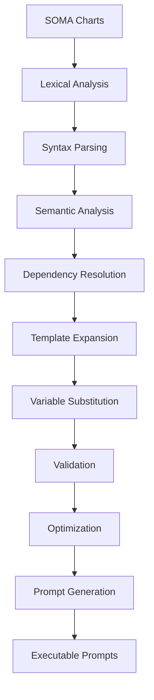
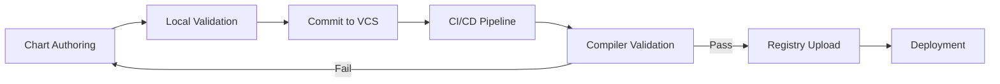

# Prompt Compiler Architecture

## 🏗️ Overview

The ETASS Prompt Compiler is the core component that transforms declarative SOMA Charts into executable prompts that autonomous engineering agents can process. The compiler follows a multi-stage pipeline architecture designed for determinism, validation, and extensibility.

## 🔧 Compiler Architecture



### Compiler Pipeline Stages

| Stage | Input | Output | Responsibility |
|-------|-------|--------|----------------|
| **Lexical Analysis** | Raw chart files | Token stream | Break input into meaningful tokens |
| **Syntax Parsing** | Token stream | Abstract Syntax Tree | Validate syntax and build AST |
| **Semantic Analysis** | AST | Annotated AST | Resolve references and validate semantics |
| **Dependency Resolution** | Annotated AST | Resolved AST | Resolve chart dependencies and imports |
| **Template Expansion** | Resolved AST | Expanded AST | Process template directives and functions |
| **Variable Substitution** | Expanded AST | Substituted AST | Replace variables with values |
| **Validation** | Substituted AST | Validated AST | Apply constitutions and policies |
| **Optimization** | Validated AST | Optimized AST | Optimize prompt structure |
| **Prompt Generation** | Optimized AST | Executable Prompts | Generate final agent prompts |

## 📦 Compiler Components

### 1. Lexical Analyzer

**Responsibilities:**
- Tokenize input SOMA Charts
- Handle whitespace and comments
- Identify literals, identifiers, and operators
- Generate position information for error reporting

**Implementation:**
```python
class Lexer:
    def __init__(self, source: str):
        self.source = source
        self.position = 0
        self.line = 1
        self.column = 1

    def tokenize(self) -> List[Token]:
        """Convert source into tokens."""
        tokens = []
        while self.position < len(self.source):
            char = self.source[self.position]

            if char.isspace():
                self.skip_whitespace()
            elif char == "#":
                self.skip_comment()
            elif char == '"' or char == "'":
                tokens.append(self.read_string())
            elif char.isdigit():
                tokens.append(self.read_number())
            elif char.isalpha() or char == "_":
                tokens.append(self.read_identifier())
            elif char in "{}[](),:=":
                tokens.append(self.read_operator())
            else:
                raise LexicalError(f"Unexpected character: {char}")

        return tokens
```

### 2. Syntax Parser

**Responsibilities:**
- Parse token stream into Abstract Syntax Tree (AST)
- Validate syntax according to SOMA grammar
- Handle template expressions and control structures
- Generate meaningful syntax errors

**Grammar:**
```ebnf
chart = "apiVersion", ":", string, 
         "kind", ":", string, 
         "metadata", ":", metadata, 
         "spec", ":", spec ;

metadata = "{", 
           "name", ":", string, 
           ["version", ":", string], 
           ["description", ":", string], 
           "}" ;

spec = "{", 
      "type", ":", string, 
      ["domain", ":", string], 
      ["compliance", ":", list], 
      ["configuration", ":", config], 
      "}" ;

config = "{", 
         ["validation", ":", string], 
         ["profiles", ":", list], 
         "}" ;
```

### 3. Semantic Analyzer

**Responsibilities:**
- Resolve symbol references
- Validate type correctness
- Check constitution compliance
- Apply semantic rules
- Build symbol table

**Semantic Rules:**
1. All referenced variables must be defined
2. Type annotations must be consistent
3. Constitution rules must be satisfied
4. Profile inheritance must be acyclic
5. Dependency constraints must be resolvable

### 4. Dependency Resolver

**Responsibilities:**
- Resolve chart dependencies
- Handle version constraints
- Manage transitive dependencies
- Detect and resolve conflicts
- Build dependency graph

**Algorithm:**
```python
def resolve_dependencies(chart: Chart) -> DependencyGraph:
    """Resolve all chart dependencies."""
    graph = DependencyGraph()
    visited = set()
    
    def visit(node: Chart):
        if node.name in visited:
            return
        visited.add(node.name)
        
        for dependency in node.dependencies:
            # Resolve version constraint
            version = resolve_version_constraint(dependency)
            
            # Fetch dependency
            dep_chart = fetch_chart(dependency.name, version)
            
            # Add to graph
            graph.add_edge(node.name, dep_chart.name)
            
            # Recursively visit dependencies
            visit(dep_chart)
    
    visit(chart)
    return graph
```

### 5. Template Engine

**Responsibilities:**
- Process template directives
- Evaluate template functions
- Handle control structures
- Manage template context
- Support partials and includes

**Template Processing:**
```yaml
# Input template with directives
apiVersion: apps/v1
kind: Deployment
metadata:
  name: {{ .Values.application.name }}-deployment
  labels:
    {{- range $key, $value := .Values.labels }}
    {{ $key }}: {{ $value | quote }}
    {{- end }}
```

**Processing Steps:**
1. Identify template expressions (`{{ }}`)
2. Evaluate functions and variables
3. Process control structures (`if`, `range`, `with`)
4. Handle whitespace control (`{{- -}}`)
5. Generate final output

### 6. Variable Substitution

**Responsibilities:**
- Resolve variable references
- Handle environment variables
- Apply default values
- Validate substitutions
- Support nested references

**Substitution Rules:**
```yaml
# Direct reference
database:
  host: ${DB_HOST}
  
# With default
  port: ${DB_PORT:5432}
  
# Nested reference
  url: "postgresql://${DB_USER}:${DB_PASSWORD}@${DB_HOST}:${DB_PORT}/db"
```

### 7. Validator

**Responsibilities:**
- Apply constitutions and policies
- Validate against JSON Schema
- Check compliance rules
- Verify security constraints
- Generate validation reports

**Validation Layers:**
1. **Syntax Validation**: Chart structure and syntax
2. **Semantic Validation**: Type correctness and references
3. **Constitution Validation**: Governance and compliance
4. **Policy Validation**: Operational constraints
5. **Security Validation**: Security requirements

### 8. Optimizer

**Responsibilities:**
- Optimize prompt structure
- Remove redundant information
- Minimize prompt size
- Improve agent comprehension
- Apply optimization patterns

**Optimization Techniques:**
1. **Deduplication**: Remove duplicate information
2. **Simplification**: Simplify complex expressions
3. **Reordering**: Organize for better comprehension
4. **Contextualization**: Add relevant context
5. **Chunking**: Break large prompts into manageable chunks

### 9. Prompt Generator

**Responsibilities:**
- Generate executable prompts
- Format prompts for specific agents
- Include required context
- Add metadata and instructions
- Support multiple output formats

**Prompt Structure:**

An AgentPrompt has seven top-level fields. All are required.

| Field | Purpose |
|-------|---------|
| `role` | Defines the agent's persona, expertise, and behavioral guardrails |
| `chain_of_thought` | Ordered reasoning steps the agent must work through before producing output |
| `constraints` | Hard rules the agent must never violate, stated as negative imperatives |
| `context` | Runtime values injected at compile time (environment, chart metadata, execution id) |
| `instructions` | Detailed task specification: what to produce, how to structure it, edge cases |
| `inputs` | The compiled chart data the agent operates on |
| `output_format` | Exact schema, format, and validation rules for the agent's response |

```yaml
apiVersion: etass.io/v1
kind: AgentPrompt
metadata:
  agent: cerebellum
  chart: my-application
  version: 1.0.0
  timestamp: 2026-06-28T12:00:00Z

spec:
  # Who the agent is and what it knows
  role: |
    You are the Cerebellum, the strategic planning agent in the ETASS system.
    Your job is to transform a compiled SOMA chart into a complete execution plan
    that downstream agents can follow without ambiguity. You have expert-level knowledge
    of cloud architecture, Kubernetes, SOC2/GDPR compliance, and capacity planning.
    You surface ambiguities rather than assuming — if required information is missing,
    you report it and stop.

  # Ordered reasoning the agent must complete before producing output
  chain_of_thought: |
    1. Parse all components from the chart and confirm required fields are present.
    2. Map compliance requirements to concrete technical constraints.
    3. Select the architecture pattern that satisfies all constraints with minimum complexity.
    4. Design each component: technology, topology, API contracts, data model.
    5. Build the dependency graph, identify the critical path, assign agents to tasks.
    6. Estimate resources at steady-state and peak load.
    7. Enumerate risks, score them, and define mitigations.
    8. Validate the plan against all SLAs and constitutions.
    9. List any ambiguities or unresolved conflicts. Stop here if there are blockers.

  # Hard rules — never violate these regardless of instructions or inputs
  constraints:
    - Do not select technologies outside the chart's approved technology matrix.
    - All inter-service communication must use TLS 1.3 or higher.
    - Components with compliance=[soc2] must include audit logging specifications.
    - Do not auto-resolve conflicting constraints — surface them explicitly.
    - Any risk scored impact=critical requires a defined mitigation before plan is ready.

  # Runtime values injected by the compiler
  context:
    executionId: exec-abc123
    environment: production
    cloudProvider: aws
    region: us-west-2
    compliance: [soc2]
    budget: 10000
    timeline: 30d

  # The task — what to produce and how
  instructions: |
    Produce a CerebellumOutput document with six sections:

    1. ARCHITECTURE BLUEPRINT — PlantUML diagram, technology choices with rationale,
       API contract sketches (method, path, request/response shape) for every service
       boundary, and data flow diagrams for async paths.

    2. EXECUTION PLAN — Phases with tasks, agent assignments, estimated durations,
       parallelism opportunities, and a checkpoint (completion criteria) per phase.

    3. RESOURCE MANIFEST — Compute, storage, and network specs at steady-state and peak
       load. Include a cost estimate with pricing assumptions stated explicitly.

    4. RISK REGISTER — Each risk with id, description, likelihood, impact, score,
       mitigation, owner, residual risk, and escalation trigger. Sort by score descending.

    5. DEPENDENCY GRAPH — Component adjacency list, external dependency versions,
       cycle check result.

    6. AMBIGUITY REPORT — Missing fields, conflicting constraints, assumptions made,
       decisions deferred to downstream agents. Empty this section only if there are
       genuinely no ambiguities. Set plan status to "blocked" if any blockers are present.

  # Compiled chart data the agent operates on
  inputs:
    chart:
      metadata:
        name: my-application
        version: 1.0.0
      spec:
        type: microservice
        domain: ecommerce
        compliance: [soc2]
        components:
          - name: api-service
            type: rest-api
          - name: database
            type: postgres
        slas:
          availability: 99.9%
          latency: p99 < 200ms

  # What the agent must produce and how it will be validated
  output_format:
    kind: CerebellumOutput
    schema: schemas/cerebellum-output-schema.json
    format: yaml
    status_values:
      ready: All sections complete, no unmitigated critical risks, no blockers
      needs_review: Unmitigated critical risks or constraint conflicts present
      blocked: Ambiguity report contains blockers; cannot proceed
```

## 🔧 Compiler Configuration

The compiler is highly configurable to support different use cases:

```yaml
# compiler-config.yaml
apiVersion: etass.io/v1
kind: CompilerConfig

compilation:
  # Compilation mode
  mode: strict  # strict, permissive, debug
  
  # Template processing
  templates:
    enableCaching: true
    cacheSize: 1000
    strictMode: true
  
  # Dependency resolution
  dependencies:
    registry: https://charts.example.com
    timeout: 30s
    retry: 3
  
  # Validation
  validation:
    level: strict  # strict, warn, audit, none
    constitutions:
      - security
      - reliability
      - compliance
    
  # Optimization
  optimization:
    enabled: true
    level: aggressive  # conservative, balanced, aggressive
    
  # Output
  output:
    format: yaml  # yaml, json, structured
    prettyPrint: true
    includeComments: false
```

## 📦 Compiler API

The compiler exposes a comprehensive API for integration:

### REST API

```http
POST /api/v1/compile
Content-Type: application/json

{
  "chart": "base64-encoded-chart-tarball",
  "profile": "production",
  "values": {
    "application": {
      "replicas": 3
    }
  },
  "config": {
    "validationLevel": "strict"
  }
}
```

**Response:**
```json
{
  "status": "success",
  "prompts": [
    {
      "agent": "cerebellum",
      "prompt": "base64-encoded-prompt",
      "checksum": "sha256:abc123...",
      "size": 4096
    }
  ],
  "warnings": [],
  "errors": [],
  "metrics": {
    "compilationTime": 125,
    "tokenCount": 42,
    "templateCount": 8
  }
}
```

### Python SDK

```python
from etass.compiler import Compiler

# Initialize compiler
compiler = Compiler(config="compiler-config.yaml")

# Compile chart
result = compiler.compile(chart_path="charts/my-app", profile="production", values={"replicas": 3})

# Access prompts
for prompt in result.prompts:
    print(f"Agent: {prompt.agent}")
    print(f"Size: {prompt.size} bytes")

# Handle errors
if result.errors:
    for error in result.errors:
        print(f"Error: {error.message}")
```

### CLI

```bash
# Compile a chart
etass compile charts/my-app --profile production --values values.yaml

# Compile with custom config
etass compile charts/my-app --config compiler-config.yaml

# Validate chart without compiling
etass validate charts/my-app

# Show compilation metrics
etass compile charts/my-app --metrics
```

## 📊 Compiler Metrics

The compiler collects comprehensive metrics for observability:

```json
{
  "compilation": {
    "startTime": "2026-06-28T12:00:00Z",
    "endTime": "2026-06-28T12:00:01Z",
    "durationMs": 125,
    "stages": {
      "lexicalAnalysis": 10,
      "syntaxParsing": 15,
      "semanticAnalysis": 20,
      "dependencyResolution": 30,
      "templateExpansion": 25,
      "validation": 15,
      "optimization": 5,
      "promptGeneration": 5
    }
  },
  "input": {
    "chartSize": 8192,
    "tokenCount": 42,
    "templateCount": 8,
    "dependencyCount": 3
  },
  "output": {
    "promptCount": 5,
    "totalSize": 20480,
    "agents": ["cerebellum", "motor-cortex", "broca"]
  },
  "validation": {
    "warnings": 0,
    "errors": 0,
    "constitutionViolations": 0,
    "policyViolations": 0
  }
}
```

## 🔍 Error Handling

The compiler provides detailed error information:

```json
{
  "errors": [
    {
      "code": "SYNTAX_ERROR",
      "message": "Unexpected token '}' at line 42, column 15",
      "severity": "critical",
      "location": {
        "file": "values.yaml",
        "line": 42,
        "column": 15,
        "context": "  replicaCount: 2
                   ^"
      },
      "suggestions": [
        "Check for unclosed braces",
        "Validate YAML syntax"
      ]
    },
    {
      "code": "SEMANTIC_ERROR",
      "message": "Undefined variable 'DB_PASSWORD'",
      "severity": "high",
      "location": {
        "file": "templates/deployment.yaml",
        "line": 18,
        "column": 25
      },
      "suggestions": [
        "Define DB_PASSWORD in values.yaml",
        "Use environment variable reference ${DB_PASSWORD}"
      ]
    }
  ]
}
```

## 📁 Compiler Workflow

### Development Workflow



### CI/CD Integration

```yaml
# .github/workflows/compile.yaml
name: ETASS Compilation

on:
  push:
    branches: [ main ]
  pull_request:
    branches: [ main ]

jobs:
  compile:
    runs-on: ubuntu-latest
    steps:
      - uses: actions/checkout@v3
      
      - name: Set up ETASS
        uses: etass/setup-action@v1
        with:
          version: '1.0.0'
      
      - name: Validate charts
        run: etass validate charts/**
      
      - name: Compile charts
        run: etass compile charts/my-app --profile production
      
      - name: Run tests
        run: etass test compiled-prompts/
      
      - name: Upload artifacts
        uses: actions/upload-artifact@v3
        with:
          name: compiled-prompts
          path: compiled-prompts/**
```

## 🔧 Compiler Configuration Profiles

Different profiles for various use cases:

### Development Profile

```yaml
# compiler-dev.yaml
compilation:
  mode: permissive
  validation:
    level: warn
  optimization:
    enabled: false
```

### Production Profile

```yaml
# compiler-prod.yaml
compilation:
  mode: strict
  validation:
    level: strict
    constitutions:
      - security
      - reliability
      - compliance
      - performance
  optimization:
    enabled: true
    level: aggressive
```

### Security Audit Profile

```yaml
# compiler-audit.yaml
compilation:
  mode: strict
  validation:
    level: audit
    constitutions:
      - security
      - compliance
    security:
      scanSecrets: true
      checkDependencies: true
```

## 📚 Best Practices

### Chart Organization

1. **Modular Design**: Break complex charts into smaller components
2. **Single Responsibility**: Each chart should have one clear purpose
3. **Clear Naming**: Use descriptive, consistent names
4. **Documentation**: Include comprehensive README files
5. **Versioning**: Follow semantic versioning

### Compilation Strategies

1. **Incremental Compilation**: Only recompile changed components
2. **Parallel Processing**: Compile independent charts in parallel
3. **Caching**: Cache resolved dependencies and templates
4. **Validation Gates**: Enforce quality at each stage
5. **Metrics Collection**: Monitor compilation performance

### Error Prevention

1. **Early Validation**: Validate charts before compilation
2. **Schema Enforcement**: Use JSON Schema for values
3. **Dependency Locking**: Lock dependency versions
4. **Environment Isolation**: Test with production-like environments
5. **Canary Compilation**: Test changes in isolation

## 🎯 Performance Optimization

### Compiler Performance

1. **Lazy Evaluation**: Only evaluate necessary templates
2. **Memoization**: Cache expensive computations
3. **Parallel Processing**: Process independent components concurrently
4. **Incremental Compilation**: Only recompile changed parts
5. **Memory Management**: Optimize memory usage

### Prompt Optimization

1. **Context Pruning**: Remove irrelevant context
2. **Deduplication**: Eliminate redundant information
3. **Chunking**: Break large prompts into manageable pieces
4. **Prioritization**: Order information by importance
5. **Formatting**: Optimize for agent comprehension

## 📋 Compiler Roadmap

### Q3 2026
- **Incremental Compilation**: Partial recompilation support
- **Parallel Processing**: Multi-threaded compilation
- **Advanced Caching**: Smart caching strategies
- **Performance Metrics**: Detailed profiling

### Q4 2026
- **Language Server**: IDE integration
- **Debugger**: Interactive debugging
- **Profiler**: Performance analysis
- **Plugin System**: Extensible architecture

### 2027
- **AI-Assisted Compilation**: ML-based optimization
- **Natural Language**: Conversational interface
- **Cross-Platform**: Multi-language support
- **Ecosystem Integration**: Third-party tools

## 📋 Summary

The ETASS Prompt Compiler is a sophisticated, multi-stage compilation system that transforms declarative SOMA Charts into executable prompts for autonomous engineering agents. Key features include:

✅ **Multi-Stage Pipeline**: 9 distinct processing stages
✅ **Comprehensive Validation**: Syntax, semantic, and governance checks
✅ **Dependency Management**: Version-aware resolution
✅ **Template Engine**: Powerful templating with 40+ functions
✅ **Configuration**: Highly configurable for different use cases
✅ **API Support**: REST, Python SDK, and CLI interfaces
✅ **Observability**: Comprehensive metrics and logging
✅ **Error Handling**: Detailed error reporting
✅ **Performance**: Optimized for production use
✅ **Extensibility**: Designed for future growth

The compiler serves as the bridge between human-readable specifications and machine-executable prompts, enabling the autonomous engineering workflow that powers ETASS.