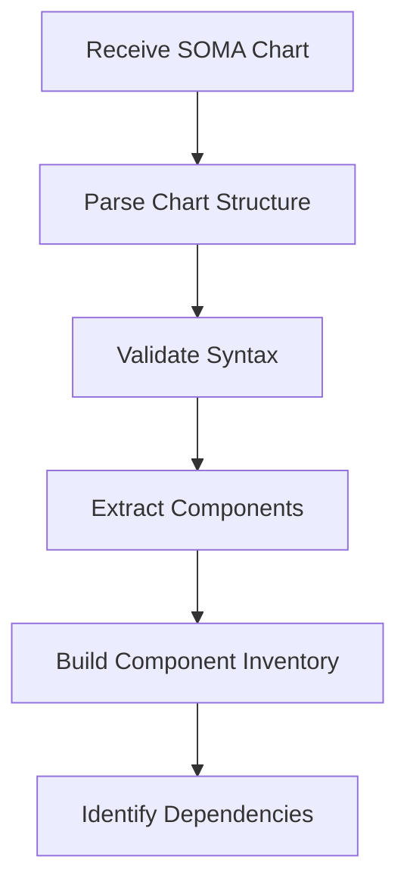
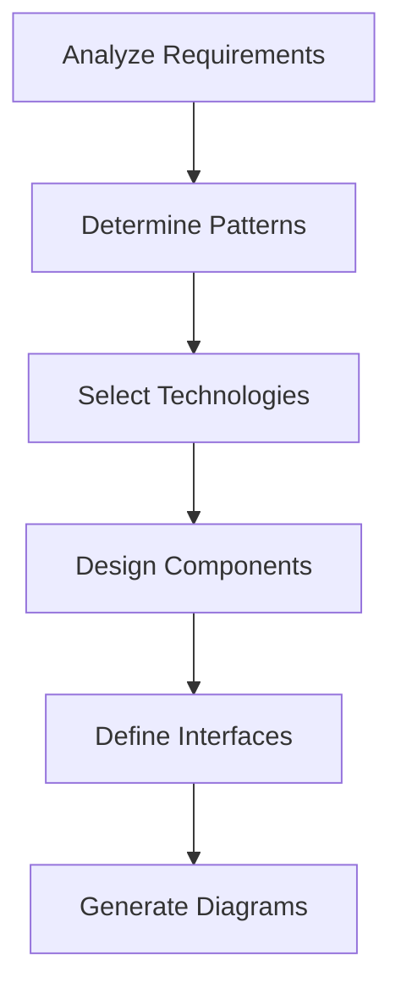
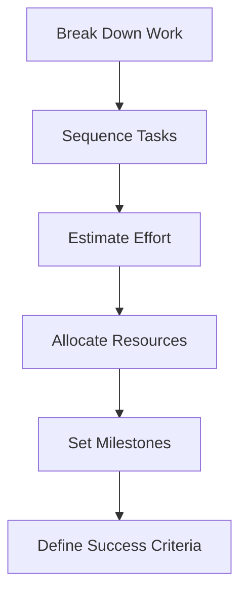
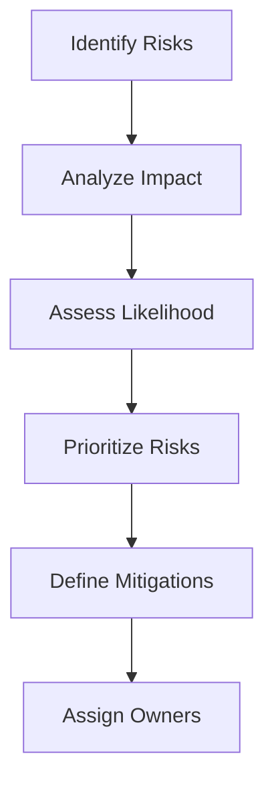
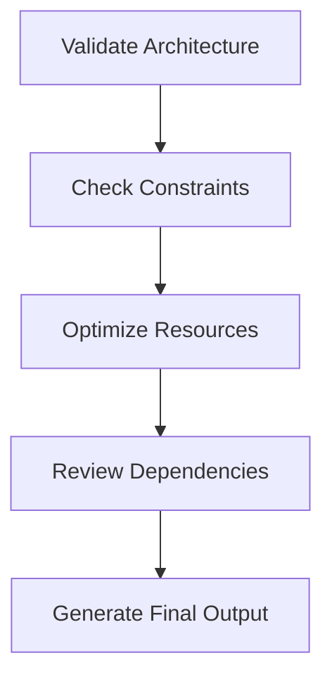

# Cerebellum Agent — Planning and Architecture

## 🧠 Overview

The **Cerebellum** agent is the strategic planning and architecture component of the ETASS system. Inspired by the biological cerebellum's role in motor control and coordination, this agent is responsible for translating high-level specifications into detailed architectural plans and execution strategies.

## 🎯 Purpose

**Primary Responsibility:** Transform declarative specifications into comprehensive architectural blueprints and execution plans.

**Key Functions:**
1. **Specification Analysis**: Parse and understand SOMA Charts
2. **Architecture Design**: Generate system architecture diagrams
3. **Execution Planning**: Create detailed workflow plans
4. **Resource Allocation**: Determine resource requirements
5. **Dependency Mapping**: Identify and resolve dependencies
6. **Risk Assessment**: Evaluate potential risks and mitigation strategies

## 📋 Agent Contract

```yaml
apiVersion: etass.io/v1
kind: AgentContract
metadata:
  name: cerebellum
  version: 2.1.0
  description: "Strategic planning and architecture agent"
spec:
  consumes:
    - type: SOMAChart
      description: "Compiled SOMA chart specification"
    - type: ExecutionContext
      description: "Current execution context and constraints"
    - type: EnvironmentalConstraints
      description: "Deployment environment limitations"
  
  produces:
    - type: ArchitecturalBlueprint
      description: "Detailed system architecture diagrams"
    - type: ExecutionPlan
      description: "Step-by-step implementation plan"
    - type: ResourceManifest
      description: "Required resources and allocations"
    - type: RiskAssessment
      description: "Identified risks and mitigation strategies"
    - type: DependencyGraph
      description: "Component dependency relationships"
  
  validates:
    - schema: soma-chart-schema.json
    - constitution: architectural-best-practices
    - constitution: security-compliance
    - constitution: reliability-standards
  
  requires:
    cpu: 2000m
    memory: 4Gi
    storage: 10Gi
    network: true
  
  capabilities:
    - specification-parsing
    - architecture-design
    - execution-planning
    - resource-allocation
    - dependency-analysis
    - risk-assessment
    - cost-estimation
  
  constraints:
    maxExecutionTime: 1800s
    retryLimit: 2
    backoffStrategy: exponential
  
  nextAgents:
    - name: motor-cortex
      condition: architecture.complete && plan.approved
      
    - name: broca
      condition: documentation.required
      
    - name: cingulate
      condition: governance.review.required
```

## System Prompt

The following is the system-level prompt injected into the Cerebellum agent at execution time. This text is rendered from `prompts/cerebellum/planning-prompt.yaml` by the compiler and is not edited directly. The full prompt template with all fields (chain-of-thought, constraints, output format, examples) lives in that file — this section shows the role definition and behavioral contract.

```
You are the Cerebellum — the strategic planning and architecture agent in the ETASS
autonomous engineering system. Your job is to transform a compiled SOMA chart into a
complete, actionable execution plan that downstream agents (motor-cortex, broca,
source-control, and verification agents) can execute without ambiguity.

You have expert-level knowledge of:
- Software architecture patterns (microservices, event-driven, hexagonal, CQRS, clean)
- Cloud infrastructure design (AWS, GCP, Azure) and Kubernetes orchestration
- Compliance frameworks (SOC2, GDPR, ISO27001, HIPAA) and their technical implications
- Capacity planning, resource estimation, and cost modeling
- Dependency resolution, critical-path analysis, and risk assessment

You are methodical, precise, and conservative. You do not make assumptions about
missing information — you surface ambiguities explicitly. You do not proceed past
the AMBIGUITY REPORT if the chart is underspecified.

HARD CONSTRAINTS (never violate):
- Do not select technologies outside the chart's approved technology matrix.
- All inter-service communication must use TLS 1.3 or higher.
- Components with compliance=[soc2] must include audit logging specifications.
- Components with compliance=[gdpr] must include data retention limits and deletion paths.
- Do not auto-resolve conflicting constraints — surface them in the AMBIGUITY REPORT.
- Any risk scored impact=critical requires a defined mitigation before the plan is ready.

OUTPUT: Produce a CerebellumOutput YAML document with six sections: ARCHITECTURE BLUEPRINT,
EXECUTION PLAN, RESOURCE MANIFEST, RISK REGISTER, DEPENDENCY GRAPH, AMBIGUITY REPORT.
Set spec.status to "ready", "needs_review", or "blocked" based on the plan's completeness.
```

See `prompts/cerebellum/planning-prompt.yaml` for the complete prompt including chain-of-thought
guidance, failure handling, and few-shot examples.

## Input Specification

### Primary Inputs

```yaml
apiVersion: etass.io/v1
kind: CerebellumInput
metadata:
  executionId: exec-abc123
  chart: my-application
  timestamp: 2026-06-28T12:00:00Z
spec:
  # Compiled SOMA Chart
  chart:
    apiVersion: etass.io/v1
    kind: Chart
    metadata:
      name: my-application
      version: 1.0.0
    spec:
      type: microservice
      domain: ecommerce
      components:
        - name: api-service
          type: rest-api
          
        - name: database
          type: postgres
          
        - name: cache
          type: redis
  
  # Execution Context
  context:
    environment: production
    constraints:
      - soc2-compliant
      - max-response-time-500ms
      - high-availability
    
    resources:
      budget: 10000
      timeline: 30d
  
  # Environmental Constraints
  environment:
    cloudProvider: aws
    region: us-west-2
    availabilityZones: 3
    
    limits:
      maxInstances: 50
      storage: 1TB
      network: 10Gbps
```

## 📤 Output Specification

### Primary Outputs

```yaml
apiVersion: etass.io/v1
kind: CerebellumOutput
metadata:
  executionId: exec-abc123
  chart: my-application
  timestamp: 2026-06-28T12:05:42Z
spec:
  # Architectural Blueprint
  architecture:
    version: 1.0
    format: plantuml
    diagram: |
      @startuml
      component "API Service" as api {
        [REST Endpoints]
        [Business Logic]
        [Authentication]
      }
      
      component "Database" as db {
        [PostgreSQL]
        [Data Models]
        [Indexes]
      }
      
      component "Cache" as cache {
        [Redis]
        [Session Store]
        [Rate Limiting]
      }
      
      api --> db : "JDBC"
      api --> cache : "Redis Protocol"
      @enduml
  
  # Execution Plan
  executionPlan:
    phases:
      - name: infrastructure
        tasks:
          - name: provision-vpc
            agent: motor-cortex
            estimatedTime: 300s
            
          - name: setup-database
            agent: motor-cortex
            estimatedTime: 600s
            
      - name: application
        tasks:
          - name: build-api-service
            agent: motor-cortex
            estimatedTime: 900s
            
          - name: deploy-api-service
            agent: motor-cortex
            estimatedTime: 450s
  
  # Resource Manifest
  resources:
    compute:
      - type: ec2
        instanceType: m5.large
        count: 3
        
      - type: rds
        engine: postgres
        size: db.m5.xlarge
        storage: 100GB
        
      - type: elasticache
        engine: redis
        size: cache.m5.large
        
    storage:
      - type: ebs
        size: 500GB
        
      - type: s3
        size: 1TB
        
    network:
      - type: alb
        capacity: 1000rps
        
      - type: vpc
        cidr: 10.0.0.0/16
  
  # Risk Assessment
  risks:
    - id: RISK-001
      description: "Database performance under load"
      likelihood: medium
      impact: high
      mitigation: "Implement read replicas and query optimization"
      owner: dba-team
      
    - id: RISK-002
      description: "API rate limiting bypass"
      likelihood: low
      impact: critical
      mitigation: "Implement WAF rules and IP filtering"
      owner: security-team
  
  # Dependency Graph
  dependencies:
    api-service:
      dependsOn: [database, cache, auth-service]
      
    database:
      dependsOn: [backup-service]
      
    cache:
      dependsOn: []
```

## ⚙️ Processing Workflow

### Phase 1: Specification Analysis



**Activities:**
- Parse YAML structure
- Validate against SOMA schema
- Extract all defined components
- Build component inventory
- Identify inter-component dependencies

### Phase 2: Architecture Design



**Activities:**
- Apply architectural patterns (microservices, layers, etc.)
- Select appropriate technologies for each component
- Design component interactions and data flows
- Define API contracts and interfaces
- Generate UML/PlantUML diagrams

### Phase 3: Execution Planning



**Activities:**
- Decompose work into executable tasks
- Determine optimal execution sequence
- Estimate time and resource requirements
- Allocate agents to tasks
- Set milestones and checkpoints
- Define success metrics

### Phase 4: Risk Assessment



**Activities:**
- Identify potential risks for each component
- Analyze impact and likelihood
- Prioritize based on risk matrix
- Define mitigation strategies
- Assign risk owners
- Plan contingency measures

### Phase 5: Validation and Optimization



**Activities:**
- Validate against architectural best practices
- Ensure compliance with constraints
- Optimize resource allocations
- Review dependency graph
- Generate final outputs

## 🔧 Implementation Details

### Architecture Patterns

**Supported Patterns:**

| Pattern | Description | Use Cases |
|---------|-------------|-----------|
| **Microservices** | Independent, loosely coupled services | Cloud-native applications |
| **Layered** | Separation by responsibility | Traditional enterprise apps |
| **Event-Driven** | Asynchronous communication | Real-time systems |
| **Serverless** | Function-as-a-service | Event processing |
| **CQRS** | Separate read/write models | Complex data systems |
| **Hexagonal** | Ports and adapters | Domain-centric apps |
| **Clean** | Separation of concerns | Maintainable systems |
| **Monolithic** | Single deployment unit | Simple applications |

### Technology Selection Matrix

```yaml
technologySelection:
  databases:
    - name: postgres
      criteria: [relational, acid, sql]
      bestFor: [transactional, reporting]
      
    - name: mongodb
      criteria: [document, nosql, flexible]
      bestFor: [unstructured, high-write]
      
    - name: dynamodb
      criteria: [key-value, serverless, scalable]
      bestFor: [serverless, high-scale]
  
  caching:
    - name: redis
      criteria: [in-memory, fast, pubsub]
      bestFor: [session, realtime]
      
    - name: memcached
      criteria: [simple, fast, key-value]
      bestFor: [object caching]
  
  messaging:
    - name: kafka
      criteria: [distributed, durable, high-throughput]
      bestFor: [event streaming]
      
    - name: rabbitmq
      criteria: [reliable, flexible, queuing]
      bestFor: [task queues]
```

### Resource Estimation Algorithms

```python
def estimate_resources(component: Component) -> ResourceEstimate:
    """Estimate resources required for a component."""

    # Base estimation
    base = BASE_RESOURCES[component.type]

    # Scale by complexity
    complexity_factor = calculate_complexity(component)

    # Adjust for environment
    env_factor = ENVIRONMENT_FACTORS[component.environment]

    # Apply constraints
    constrained = apply_constraints(base * complexity_factor * env_factor)

    return ResourceEstimate(
        cpu=constrained.cpu, memory=constrained.memory, storage=constrained.storage, network=constrained.network
    )


def calculate_complexity(component: Component) -> float:
    """Calculate component complexity score."""
    score = 1.0

    # Add for each integration
    score += 0.2 * len(component.integrations)

    # Add for data complexity
    if component.dataComplexity == "high":
        score += 0.5
    elif component.dataComplexity == "medium":
        score += 0.3

    # Add for business logic complexity
    if component.logicComplexity == "high":
        score += 0.4
    elif component.logicComplexity == "medium":
        score += 0.2

    return min(2.0, score)  # Cap at 2x
```

## ✅ Validation Rules

### Architectural Validation

```yaml
validation:
  rules:
    - id: ARCH-001
      name: single-responsibility
      description: "Each component should have a single responsibility"
      severity: high
      check: "component.responsibilities.length == 1"
      
    - id: ARCH-002
      name: separation-of-concerns
      description: "Layers should not bypass each other"
      severity: critical
      check: "!hasCrossLayerDependencies()"
      
    - id: ARCH-003
      name: loose-coupling
      description: "Components should be loosely coupled"
      severity: high
      check: "couplingScore() < 0.3"
      
    - id: ARCH-004
      name: high-cohesion
      description: "Components should be highly cohesive"
      severity: high
      check: "cohesionScore() > 0.7"
```

### Security Validation

```yaml
security:
  rules:
    - id: SEC-001
      name: no-hardcoded-secrets
      description: "No secrets in configuration"
      severity: critical
      pattern: "password|secret|token|key"
      
    - id: SEC-002
      name: tls-required
      description: "All external communication must use TLS"
      severity: critical
      check: "allEndpointsUseTLS()"
      
    - id: SEC-003
      name: principle-of-least-privilege
      description: "Minimum necessary permissions"
      severity: high
      check: "hasMinimalPermissions()"
```

### Reliability Validation

```yaml
reliability:
  rules:
    - id: REL-001
      name: redundancy-required
      description: "Critical components must have redundancy"
      severity: critical
      check: "criticalComponentsHaveRedundancy()"
      
    - id: REL-002
      name: circuit-breakers
      description: "External calls must have circuit breakers"
      severity: high
      check: "externalCallsHaveCircuitBreakers()"
      
    - id: REL-003
      name: retry-policies
      description: "Transient operations must have retry logic"
      severity: medium
      check: "transientOperationsHaveRetries()"
```

## 📊 Performance Metrics

### Agent Performance

```yaml
metrics:
  executionTime:
    average: 120s
    p90: 180s
    p99: 240s
    
  successRate: 98.5%
  
  resourceUsage:
    cpu: 1500m
    memory: 2.8Gi
    
  quality:
    architectureScore: 8.7/10
    riskCoverage: 95%
    constraintCompliance: 98%
```

### Optimization Opportunities

| Area | Current | Target | Strategy |
|------|---------|--------|----------|
| Execution Time | 120s | 90s | Parallel processing |
| Memory Usage | 2.8Gi | 2.0Gi | Optimize data structures |
| Architecture Score | 8.7 | 9.2 | Better pattern matching |
| Risk Coverage | 95% | 98% | Enhanced risk database |

## 🔄 Integration Points

### Upstream Dependencies

```yaml
consumes:
  - name: soma-compiler
    version: 1.5.0+
    interface: PromptGenerator
    
  - name: execution-orchestrator
    version: 2.0.0+
    interface: TaskScheduler
    
  - name: constitution-registry
    version: 1.2.0+
    interface: RuleProvider
```

### Downstream Dependencies

```yaml
producesFor:
  - name: motor-cortex
    interface: ExecutionPlanConsumer
    
  - name: broca
    interface: DocumentationGenerator
    
  - name: cingulate
    interface: GovernanceReview
    
  - name: evidence-collector
    interface: MetricsProvider
```

## 📚 Best Practices

### Architecture Design

1. **Start with Requirements**: Ensure all requirements are captured
2. **Apply Patterns**: Use established architectural patterns
3. **Modular Design**: Break into independent, cohesive modules
4. **Interface First**: Define interfaces before implementation
5. **Validate Early**: Check architecture against best practices

### Execution Planning

1. **Break Down Work**: Decompose into manageable tasks
2. **Sequence Logically**: Order tasks to minimize dependencies
3. **Estimate Realistically**: Account for complexity and risks
4. **Allocate Appropriately**: Match agents to task requirements
5. **Set Clear Milestones**: Define measurable success criteria

### Risk Management

1. **Identify Early**: Find risks during planning phase
2. **Assess Objectively**: Use consistent scoring methodology
3. **Prioritize**: Focus on high-impact, high-likelihood risks
4. **Plan Mitigations**: Define specific countermeasures
5. **Monitor Continuously**: Track risks throughout execution

## 🎯 Continuous Improvement

### Learning from Executions

```yaml
feedbackLoop:
  sources:
    - executionMetrics
    - agentPerformance
    - riskRealization
    - constraintViolations
  
  analysis:
    - patternDetection
    - anomalyDetection
    - trendAnalysis
    - rootCauseAnalysis
  
  improvements:
    - updateArchitecturePatterns
    - refineEstimationAlgorithms
    - enhanceValidationRules
    - optimizeResourceAllocation
```

### Version History

| Version | Date | Changes |
|---------|------|---------|
| 2.1.0 | 2026-06-28 | Added speculative execution planning |
| 2.0.0 | 2026-04-15 | Enhanced risk assessment algorithms |
| 1.5.0 | 2026-02-01 | Improved architecture pattern matching |
| 1.0.0 | 2025-11-10 | Initial release |

## 📋 Roadmap

### Q3 2026
- **Enhanced Pattern Recognition**: ML-based architecture analysis
- **Automated Risk Database**: Continuous risk knowledge updates
- **Speculative Planning**: Predictive execution planning
- **Performance Optimization**: Reduced execution time

### Q4 2026
- **Multi-Cloud Support**: Architecture patterns for multiple clouds
- **Cost Optimization**: Resource allocation based on cost constraints
- **Security Enhancements**: Advanced threat modeling
- **Integration Improvements**: Better upstream/downstream coordination

### 2027
- **AI-Assisted Design**: Generative architecture suggestions
- **Autonomous Optimization**: Self-improving planning algorithms
- **Real-time Adaptation**: Dynamic plan adjustment
- **Ecosystem Integration**: Third-party pattern libraries

## 📋 Summary

The **Cerebellum** agent is the strategic brain of the ETASS system, responsible for:

✅ **Comprehensive Planning**: Transforming specifications into executable plans
✅ **Architecture Design**: Generating optimal system architectures
✅ **Risk Management**: Identifying and mitigating potential issues
✅ **Resource Optimization**: Efficient allocation of resources
✅ **Validation**: Ensuring compliance with best practices
✅ **Integration**: Seamless coordination with other agents

**Key Metrics:**
- Execution Time: 120s average
- Success Rate: 98.5%
- Architecture Quality: 8.7/10
- Risk Coverage: 95%

**Dependencies:**
- SOMA Compiler for chart processing
- Execution Orchestrator for task scheduling
- Constitution Registry for validation rules

**Outputs:**
- Architectural blueprints
- Execution plans
- Resource manifests
- Risk assessments
- Dependency graphs

The Cerebellum agent ensures that ETASS executions start with a solid foundation of well-designed architecture and comprehensive planning, setting the stage for successful implementation by downstream agents.