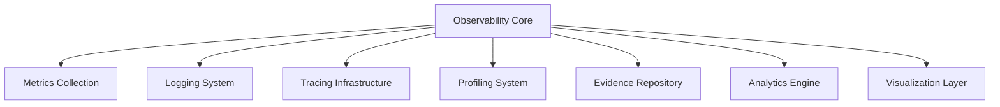
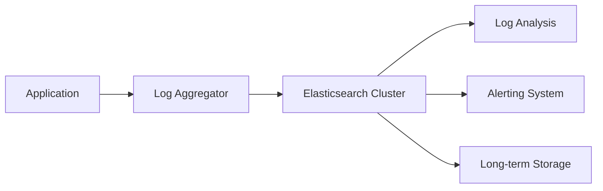
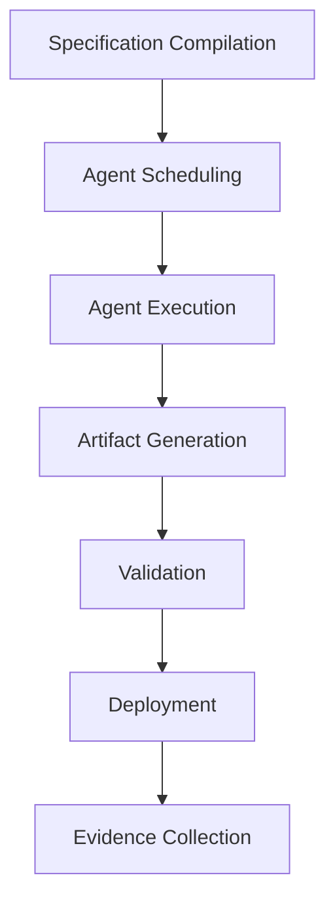
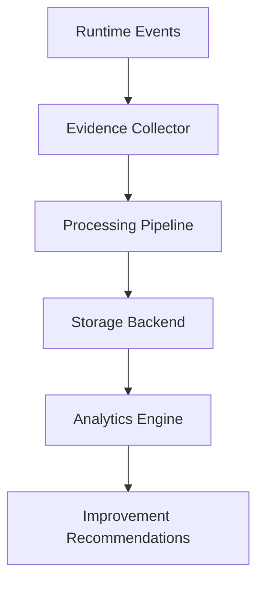
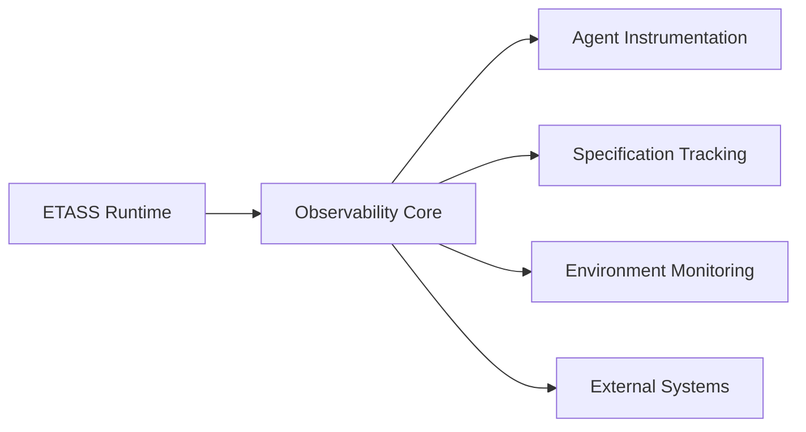

# Runtime Intelligence — Observability Architecture

## 👁️ Overview

The ETASS Runtime Intelligence system provides comprehensive observability capabilities that enable autonomous agents and human operators to monitor, analyze, and optimize the software engineering process. This architecture ensures complete visibility into specification compilation, agent execution, system deployment, and operational behavior.

## 🎯 Objectives

### Primary Objectives

1. **Complete Visibility**: Monitor all aspects of the specification-driven development process
2. **Real-time Monitoring**: Provide immediate feedback on system state and agent performance
3. **Historical Analysis**: Enable post-mortem analysis and trend identification
4. **Evidence Collection**: Gather operational data for continuous improvement
5. **Agent Optimization**: Provide data for agent performance tuning

### Secondary Objectives

1. **Anomaly Detection**: Identify deviations from expected behavior
2. **Performance Optimization**: Enable data-driven system improvements
3. **Compliance Monitoring**: Ensure adherence to governance policies
4. **Cost Analysis**: Track resource utilization and efficiency
5. **Predictive Analytics**: Forecast system behavior and requirements

## 🏗️ Architecture Components

The Runtime Intelligence system consists of several integrated components:



## 📊 Metrics Collection

### Metric Types

#### 1. System Metrics
- **Resource Utilization**: CPU, memory, disk, network usage
- **Agent Performance**: Execution time, success rates, error rates
- **Throughput**: Specifications processed per unit time
- **Latency**: End-to-end processing time
- **Queue Depth**: Pending specification jobs

#### 2. Specification Metrics
- **Compilation Time**: Time to compile prompts from charts
- **Complexity Score**: Measure of specification complexity
- **Dependency Depth**: Number of transitive dependencies
- **Validation Results**: Number of validation warnings/errors

#### 3. Agent Metrics
- **Execution Duration**: Time taken for agent tasks
- **Success Rate**: Percentage of successful completions
- **Retry Count**: Number of retries required
- **Resource Consumption**: Memory and CPU usage per agent
- **Output Quality**: Metrics on generated artifacts

#### 4. Runtime Metrics
- **State Transitions**: Frequency and duration of state changes
- **Concurrency Level**: Number of parallel executions
- **Error Rates**: Frequency of runtime errors
- **Recovery Time**: Time to recover from failures

### Metric Collection Implementation

```yaml
# Example metrics configuration
metrics:
  collection:
    interval: 15s
    retention: 30d
    backends:
      - prometheus
      - influxdb
      - elasticsearch
  
  system:
    enabled: true
    resource_utilization: true
    performance: true
  
  specification:
    enabled: true
    complexity_analysis: true
    dependency_tracking: true
  
  agents:
    enabled: true
    performance_profiling: true
    quality_metrics: true
```

## 📝 Logging System

### Log Structure

ETASS uses structured logging with the following fields:

```json
{
  "timestamp": "2026-06-28T13:45:22.123Z",
  "level": "INFO",
  "component": "runtime",
  "agent": "cerebellum",
  "specification": "ecommerce-v1.2.3",
  "operation": "plan_generation",
  "message": "Generated execution plan with 12 steps",
  "context": {
    "execution_id": "abc-123-def",
    "step": 3,
    "duration_ms": 456,
    "artifacts_generated": ["plan.yaml", "dependencies.json"]
  },
  "tags": ["planning", "success"]
}
```

### Log Levels

| Level | Usage | Retention |
|-------|-------|-----------|
| TRACE | Detailed debugging information | 7 days |
| DEBUG | Development debugging | 14 days |
| INFO | Normal operation messages | 30 days |
| WARN | Potential issues | 60 days |
| ERROR | Failed operations | 90 days |
| FATAL | System-critical failures | Permanent |

### Log Management



## 🔗 Tracing Infrastructure

### Distributed Tracing

ETASS implements comprehensive distributed tracing using OpenTelemetry standards:

```yaml
# Tracing configuration
tracing:
  enabled: true
  sampler: always_on
  exporters:
    - jaeger
    - zipkin
    - otlp
  
  service_name: etass-runtime
  resource_attributes:
    service.version: 1.0.0
    deployment.environment: production
```

### Trace Structure



Each trace includes:
- **Trace ID**: Unique identifier for the entire workflow
- **Span ID**: Unique identifier for each operation
- **Parent Span ID**: Relationship to parent operation
- **Operation Name**: Descriptive name of the operation
- **Start/End Timestamps**: Precise timing information
- **Tags**: Key-value metadata
- **Logs**: Associated log entries

## 📈 Profiling System

### Performance Profiling

ETASS includes comprehensive profiling capabilities:

```yaml
# Profiling configuration
profiling:
  enabled: true
  modes:
    - cpu
    - memory
    - heap
    - goroutine
    - block
    - mutex
  
  sampling:
    cpu: 100hz
    memory: 500ms
    heap: 1024
  
  storage:
    backend: elasticsearch
    retention: 14d
```

### Profiling Data Types

1. **CPU Profiling**: Function-level execution time analysis
2. **Memory Profiling**: Heap allocation patterns
3. **Goroutine Profiling**: Concurrency analysis
4. **Block Profiling**: Synchronization bottlenecks
5. **Mutex Profiling**: Lock contention analysis
6. **Agent Profiling**: Individual agent performance

## 🗃️ Evidence Repository

### Evidence Collection

The evidence repository stores all operational data for continuous improvement:



### Evidence Types

| Type | Description | Retention |
|------|-------------|-----------|
| Execution Logs | Complete agent execution history | 1 year |
| Performance Metrics | Runtime performance data | 2 years |
| Artifact Snapshots | Generated code and documentation | Permanent |
| Validation Results | Testing and verification outcomes | 5 years |
| Deployment Records | Environment and configuration data | Permanent |
| User Feedback | Human review and ratings | Permanent |
| Error Reports | Failure analysis and root causes | Permanent |

### Evidence Schema

```json
{
  "evidence_id": "evid-20260628-001",
  "specification": "ecommerce-v1.2.3",
  "execution_id": "exec-abc-123",
  "timestamp": "2026-06-28T13:45:22.123Z",
  "type": "performance_metric",
  "data": {
    "agent": "cerebellum",
    "operation": "plan_generation",
    "duration_ms": 456,
    "memory_usage_mb": 128,
    "cpu_usage_percent": 45,
    "artifacts": [
      {
        "name": "plan.yaml",
        "size_bytes": 1024,
        "complexity_score": 8.2
      }
    ]
  },
  "context": {
    "environment": "production",
    "runtime_version": "1.0.0",
    "dependencies": ["auth-service", "payment-gateway"]
  },
  "quality_score": 9.1,
  "tags": ["planning", "performance", "success"]
}
```

## 📊 Analytics Engine

### Analysis Capabilities

1. **Trend Analysis**: Identify patterns over time
2. **Anomaly Detection**: Spot unusual behavior
3. **Performance Optimization**: Recommend improvements
4. **Quality Assessment**: Evaluate artifact quality
5. **Dependency Analysis**: Map system relationships
6. **Impact Analysis**: Assess change effects

### Machine Learning Integration

```yaml
# ML analytics configuration
analytics:
  ml_models:
    - name: performance_predictor
      type: regression
      input_features: [complexity, dependencies, agent_type]
      output_feature: execution_time
      training_interval: 24h
    
    - name: quality_assessor
      type: classification
      input_features: [code_metrics, test_coverage, validation_results]
      output_feature: quality_score
      training_interval: 48h
    
    - name: anomaly_detector
      type: isolation_forest
      input_features: [all_metrics]
      output_feature: anomaly_score
      training_interval: 1h
```

## 🎨 Visualization Layer

### Dashboard Components

1. **System Overview**: High-level health and status
2. **Agent Performance**: Individual agent metrics
3. **Specification Flow**: End-to-end process visualization
4. **Quality Metrics**: Artifact quality trends
5. **Error Analysis**: Failure patterns and root causes
6. **Resource Utilization**: System resource monitoring

### Visualization Tools

```yaml
# Visualization configuration
visualization:
  backends:
    - grafana
    - kibana
    - custom_dashboard
  
  dashboards:
    - name: system_overview
      refresh_interval: 30s
      panels: [health_status, agent_performance, resource_utilization]
    
    - name: agent_analysis
      refresh_interval: 60s
      panels: [execution_time, success_rate, error_analysis]
    
    - name: specification_flow
      refresh_interval: 5m
      panels: [process_map, dependency_graph, timeline]
```

## 🔧 Integration Points

### Runtime Integration



### External System Integrations

| System | Purpose | Integration Method |
|--------|---------|-------------------|
| Prometheus | Metrics collection | Push gateway |
| Elasticsearch | Log storage | REST API |
| Jaeger | Distributed tracing | OpenTelemetry |
| Grafana | Visualization | Data source plugin |
| InfluxDB | Time-series data | HTTP API |
| Kafka | Event streaming | Producer/Consumer |
| S3 | Long-term storage | Object storage API |

## 🛡️ Security Considerations

### Data Protection

1. **Encryption**: All data encrypted at rest and in transit
2. **Access Control**: Role-based access to observability data
3. **Audit Logging**: Complete audit trail of data access
4. **Data Masking**: Sensitive information redaction
5. **Retention Policies**: Automatic data purging

### Compliance

```yaml
# Security configuration
security:
  encryption:
    at_rest: aes-256
    in_transit: tls-1.3
  
  access_control:
    roles:
      - admin
      - operator
      - viewer
      - auditor
    
  audit_logging:
    enabled: true
    retention: 7years
  
  data_protection:
    masking:
      enabled: true
      patterns: ["password", "secret", "token", "key"]
```

## 🎯 Implementation Guidelines

### Best Practices

1. **Comprehensive Instrumentation**: Instrument all critical paths
2. **Standardized Metrics**: Use consistent naming conventions
3. **Context Propagation**: Maintain context across distributed operations
4. **Sampling Strategies**: Balance detail with performance
5. **Data Retention**: Align with compliance requirements
6. **Alert Thresholds**: Set meaningful alert conditions
7. **Performance Impact**: Minimize observability overhead

### Anti-Patterns

1. **Over-instrumentation**: Collecting excessive data
2. **Inconsistent Naming**: Non-standard metric names
3. **Missing Context**: Logs without proper context
4. **Ignored Alerts**: Alert fatigue from poor thresholds
5. **Data Hoarding**: Keeping data beyond retention periods

## 📚 Examples

### Agent Instrumentation Example

```python
# Example agent with observability instrumentation
class CerebellumAgent:
    def __init__(self, observability_client):
        self.observability = observability_client
        self.logger = observability_client.get_logger(__name__)
        self.metrics = observability_client.get_metrics(__name__)
        self.tracer = observability_client.get_tracer(__name__)

    def execute(self, specification):
        with self.tracer.start_span("cerebellum_execution"):
            # Start performance metrics
            start_time = time.time()
            self.metrics.increment("agent.executions.started")

            try:
                self.logger.info("Starting plan generation", specification=specification.id)

                # Agent logic here
                plan = self._generate_plan(specification)

                # Record success
                duration = time.time() - start_time
                self.metrics.record("agent.execution.duration", duration)
                self.metrics.increment("agent.executions.success")

                self.logger.info("Plan generation completed", duration=duration, plan_steps=len(plan.steps))

                return plan

            except Exception as e:
                self.metrics.increment("agent.executions.failed")
                self.logger.error("Plan generation failed", error=str(e))
                raise
```

### Specification Tracking Example

```yaml
# Specification tracking configuration
specification_tracking:
  enabled: true
  
  events:
    - name: compilation_start
      metrics:
        - compilation.time.start
      logs:
        - level: INFO
          message: "Compilation started for {{specification.name}}"
    
    - name: compilation_complete
      metrics:
        - compilation.time.duration
        - compilation.complexity.score
      logs:
        - level: INFO
          message: "Compilation completed for {{specification.name}}"
      
    - name: agent_scheduled
      metrics:
        - agent.scheduling.count
      logs:
        - level: DEBUG
          message: "Agent {{agent.name}} scheduled for {{specification.name}}"
```

## 📈 Performance Considerations

### Optimization Strategies

1. **Sampling**: Reduce data volume through intelligent sampling
2. **Batching**: Aggregate metrics before transmission
3. **Compression**: Compress data in transit
4. **Caching**: Cache frequently accessed observability data
5. **Indexing**: Optimize database queries with proper indexing
6. **Partitioning**: Distribute data across multiple storage nodes

### Performance Targets

| Component | Target Latency | Target Throughput |
|-----------|----------------|-------------------|
| Metrics Collection | < 100ms | 10,000 metrics/sec |
| Log Ingestion | < 200ms | 5,000 logs/sec |
| Trace Processing | < 300ms | 1,000 spans/sec |
| Query Response | < 500ms | 100 queries/sec |
| Dashboard Render | < 1s | 50 users concurrent |

## 🔄 Evolution and Maintenance

### Continuous Improvement

1. **Regular Review**: Quarterly observability architecture reviews
2. **Technology Updates**: Stay current with observability tools
3. **Performance Tuning**: Optimize based on usage patterns
4. **New Metric Types**: Add metrics as new requirements emerge
5. **User Feedback**: Incorporate operator and agent feedback

### Deprecation Policy

```yaml
deprecation:
  policy:
    - metrics: 6 months notice before removal
    - logs: 12 months notice before format changes
    - traces: 6 months notice before schema changes
    - dashboards: 3 months notice before removal
  
  communication:
    - email_notifications: true
    - system_alerts: true
    - documentation_updates: true
```

## 🎓 Training and Adoption

### Operator Training

1. **Observability Fundamentals**: Metrics, logs, traces basics
2. **ETASS-Specific Instrumentation**: Agent and specification tracking
3. **Dashboard Creation**: Building effective visualizations
4. **Alert Configuration**: Setting meaningful thresholds
5. **Troubleshooting**: Using observability for debugging

### Agent Integration

1. **Instrumentation Patterns**: Standard approaches to agent monitoring
2. **Context Propagation**: Maintaining trace context
3. **Performance Optimization**: Minimizing observability overhead
4. **Error Handling**: Proper error reporting and logging
5. **Quality Metrics**: Measuring agent output quality

## 📋 Success Criteria

### Implementation Success

✅ **Comprehensive Coverage**: All critical paths instrumented
✅ **Real-time Visibility**: Immediate access to system state
✅ **Historical Analysis**: Complete historical data available
✅ **Agent Optimization**: Data-driven agent improvements
✅ **Anomaly Detection**: Effective issue identification
✅ **Performance Impact**: Minimal overhead on runtime
✅ **User Adoption**: Operators effectively using observability tools

### Operational Success

✅ **Reduced MTTR**: Mean time to resolution improved by 50%
✅ **Increased Quality**: Artifact quality scores improved by 25%
✅ **Better Performance**: Agent execution time reduced by 20%
✅ **Proactive Monitoring**: 80% of issues detected before user impact
✅ **Continuous Improvement**: Regular observability-driven enhancements

## 🎯 Conclusion

The ETASS Runtime Intelligence system provides a comprehensive observability architecture that enables complete visibility into the specification-driven development process. By integrating metrics, logging, tracing, profiling, and evidence collection, the system supports autonomous agents in continuously improving software engineering practices while providing human operators with the tools needed for governance and oversight.

This architecture ensures that ETASS can deliver on its promise of transforming software engineering into a precise, observable, and continuously improving discipline.