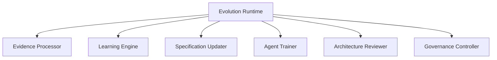
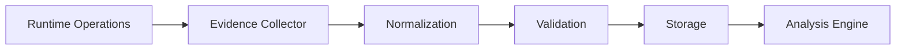
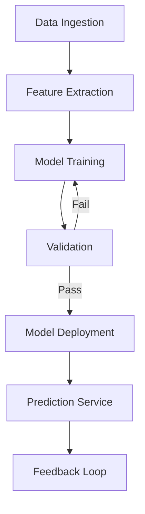
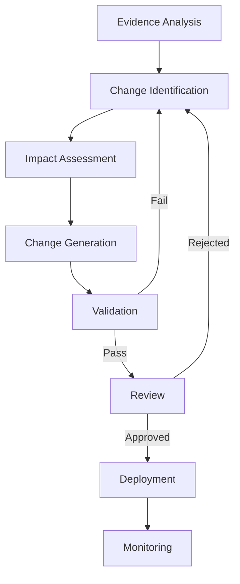
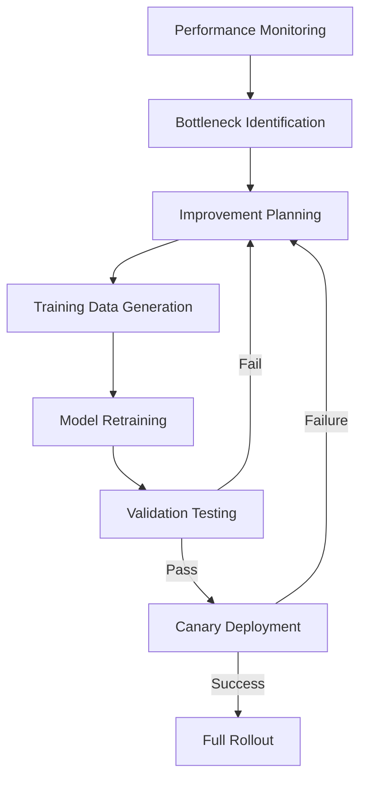
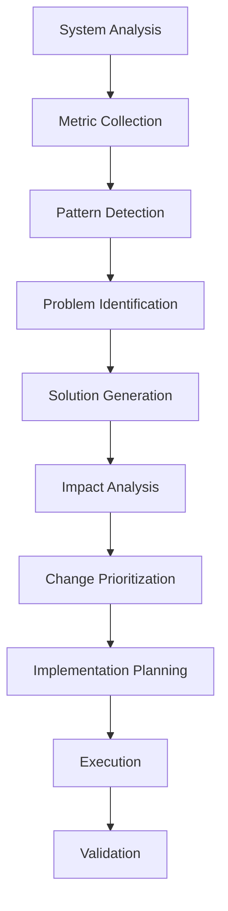
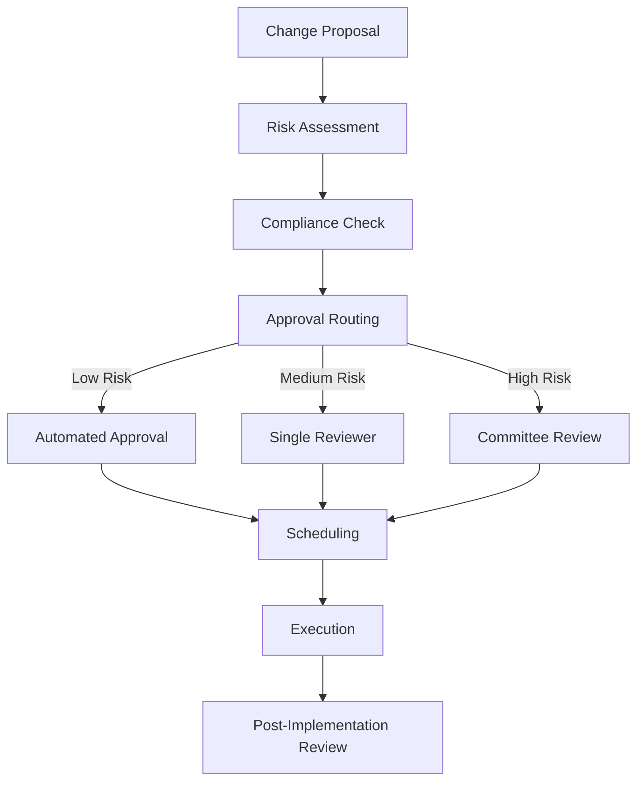
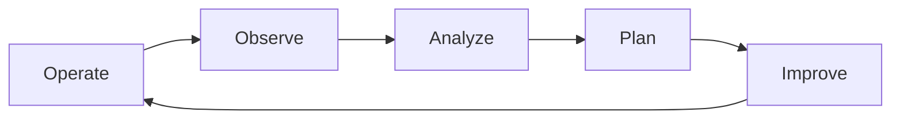
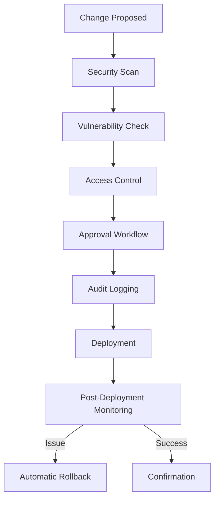

# Evolution Runtime — Continuous Improvement System

## 🔄 Overview

The ETASS Evolution Runtime implements a sophisticated continuous improvement system that enables autonomous agents to learn from operational evidence and progressively enhance software specifications, agent behaviors, and system architectures. This closed-loop engineering system ensures that ETASS systems continuously evolve toward optimal performance, quality, and reliability.

## 🎯 Objectives

### Primary Objectives

1. **Closed-Loop Engineering**: Create feedback loops from operations to specifications
2. **Autonomous Learning**: Enable agents to improve based on evidence
3. **Specification Evolution**: Continuously refine SOMA charts
4. **Agent Optimization**: Enhance agent performance and capabilities
5. **Architecture Improvement**: Evolve system designs over time

### Secondary Objectives

1. **Quality Enhancement**: Continuously improve artifact quality
2. **Performance Optimization**: Reduce resource consumption and execution time
3. **Reliability Improvement**: Increase system uptime and resilience
4. **Cost Reduction**: Optimize resource utilization
5. **Innovation Acceleration**: Enable rapid experimentation and learning

## 🏗️ Architecture Components



## 📊 Evidence Processing

### Evidence Collection Pipeline



### Evidence Types

1. **Execution Metrics**: Performance data from agent operations
2. **Quality Metrics**: Artifact validation and testing results
3. **Error Reports**: Failure analysis and root cause data
4. **User Feedback**: Human review and rating information
5. **Operational Data**: Production system telemetry
6. **Dependency Analysis**: System relationship mappings

### Evidence Processing Workflow

```yaml
# Evidence processing configuration
evidence_processing:
  collection:
    interval: 60s
    batch_size: 1000
    retention: 5years
  
  normalization:
    schemas:
      - execution_metrics
      - quality_metrics
      - error_reports
      - user_feedback
  
  validation:
    rules:
      - required_fields: [timestamp, source, type]
      - data_quality: {min_score: 0.8}
      - consistency_checks: true
  
  storage:
    backend: elasticsearch
    indexing: daily
    sharding: {shards: 5, replicas: 2}
```

## 🧠 Learning Engine

### Machine Learning Models

```yaml
# Learning engine configuration
learning_engine:
  models:
    - name: performance_predictor
      type: gradient_boosting
      input: [complexity, dependencies, historical_performance]
      output: predicted_execution_time
      training: {interval: 24h, epochs: 100}
      
    - name: quality_assessor
      type: neural_network
      input: [code_metrics, test_coverage, validation_results]
      output: quality_score
      training: {interval: 48h, epochs: 200}
      
    - name: error_classifier
      type: random_forest
      input: [error_patterns, context_features, system_state]
      output: error_category
      training: {interval: 12h, epochs: 50}
      
    - name: optimization_recommender
      type: reinforcement_learning
      input: [current_state, performance_metrics, constraints]
      output: recommended_changes
      training: {interval: 1h, episodes: 1000}
```

### Learning Workflow



## 📝 Specification Updater

### Evolution Process

```yaml
# Specification update configuration
specification_updater:
  strategies:
    - name: incremental_improvement
      approach: small, frequent changes
      risk_level: low
      validation: automated
      
    - name: architectural_refactoring
      approach: structural changes
      risk_level: high
      validation: human_review_required
      
    - name: dependency_optimization
      approach: dependency graph improvements
      risk_level: medium
      validation: automated_with_override
  
  validation:
    automated:
      - syntax_validation
      - semantic_validation
      - regression_testing
      
    human_review:
      required_for: [architectural_refactoring, major_changes]
      timeout: 48h
      quorum: 2_approvers
```

### Update Workflow



## 🤖 Agent Trainer

### Agent Improvement Process

```yaml
# Agent training configuration
agent_trainer:
  improvement_areas:
    - planning_accuracy
    - code_quality
    - documentation_completeness
    - error_recovery
    - resource_efficiency
  
  training_methods:
    - name: prompt_refinement
      approach: iterative prompt optimization
      metrics: [success_rate, quality_score]
      
    - name: behavior_tuning
      approach: parameter optimization
      metrics: [execution_time, memory_usage]
      
    - name: skill_enhancement
      approach: capability expansion
      metrics: [feature_coverage, complexity_handling]
  
  validation:
    a_b_testing: true
    canary_deployment: {percentage: 10}
    rollback: {window: 24h, metrics: [success_rate, error_rate]}
```

### Agent Evolution Lifecycle



## 🏛️ Architecture Reviewer

### Review Process

```yaml
# Architecture review configuration
architecture_reviewer:
  review_criteria:
    - modularity: {weight: 0.3, threshold: 0.8}
    - coupling: {weight: 0.2, threshold: 0.7}
    - cohesion: {weight: 0.2, threshold: 0.85}
    - testability: {weight: 0.15, threshold: 0.9}
    - maintainability: {weight: 0.15, threshold: 0.8}
  
  review_triggers:
    - schedule: weekly
    - on_major_changes: true
    - on_performance_degradation: {threshold: 15%}
    - on_error_rate_increase: {threshold: 10%}
  
  improvement_strategies:
    - refactoring: {max_complexity_reduction: 30%}
    - decoupling: {target_coupling_reduction: 25%}
    - modularization: {target_module_size: 500-1000_loc}
    - interface_standardization: {compliance_target: 95%}
```

### Architecture Evolution Workflow



## 🛡️ Governance Controller

### Governance Policies

```yaml
# Governance configuration
governance:
  change_control:
    risk_levels:
      - low: {approval: automated, rollback: auto}
      - medium: {approval: single_reviewer, rollback: manual}
      - high: {approval: committee, rollback: manual_with_review}
    
    change_windows:
      - production: {days: [mon, wed, fri], hours: [2-4]}
      - development: {days: [mon-fri], hours: [9-17]}
    
    freeze_periods:
      - holidays: [2026-12-24, 2026-12-31]
      - release_weeks: {before_release: 7days, after_release: 3days}
  
  compliance:
    standards: [iso_27001, soc2, gdpr]
    audits: {frequency: quarterly, sampling: 10%}
    reporting: {frequency: monthly, recipients: [compliance_team]}
  
  security:
    vulnerability_scanning: {frequency: daily, remediation_sla: 7days}
    penetration_testing: {frequency: quarterly, scope: full_system}
    access_reviews: {frequency: biannual, coverage: all_privileged_access}
```

### Governance Workflow



## 🔄 Continuous Improvement Cycle

### Improvement Lifecycle



### Detailed Cycle

```yaml
# Continuous improvement cycle configuration
improvement_cycle:
  operate:
    duration: continuous
    monitoring: real-time
    data_collection: comprehensive
    
  observe:
    frequency: continuous
    metrics: [performance, quality, reliability, cost]
    thresholds:
      performance_degradation: 10%
      quality_regression: 5%
      reliability_issues: any_outage
      cost_increase: 15%
    
  analyze:
    methods: [statistical, ml, expert_review]
    depth: [shallow, medium, deep]
    prioritization: [impact, feasibility, risk]
    
  plan:
    horizon: [short_term, medium_term, long_term]
    resources: [automated, agent_assisted, human]
    validation: [simulation, a_b_testing, canary]
    
  improve:
    approaches: [incremental, architectural, revolutionary]
    deployment: [automated, staged, manual]
    monitoring: [real-time, post_deployment, long_term]
```

## 📊 Performance Metrics

### Evolution Metrics

| Category | Metric | Target | Current |
|----------|--------|--------|---------|
| Quality | Artifact quality score | 9.5/10 | 8.7/10 |
| Performance | Execution time reduction | 20% annual | 15% annual |
| Reliability | MTBF improvement | 30% annual | 25% annual |
| Cost | Resource efficiency | 15% annual | 12% annual |
| Innovation | New features delivered | 4/quarter | 3/quarter |

### Improvement Tracking

```yaml
# Improvement tracking configuration
improvement_tracking:
  metrics:
    - name: quality_score
      target: 9.5
      current: 8.7
      trend: improving
      
    - name: execution_time
      target: 20%_reduction
      current: 15%_reduction
      trend: improving
      
    - name: error_rate
      target: 0.5%_or_lower
      current: 0.8%
      trend: improving
      
    - name: resource_efficiency
      target: 15%_improvement
      current: 12%_improvement
      trend: stable
  
  reporting:
    frequency: weekly
    format: [dashboard, email, slack]
    recipients: [engineering_team, management, stakeholders]
```

## 🎯 Implementation Examples

### Specification Evolution Example

```yaml
# Before evolution
apiVersion: etass.io/v1
kind: Chart
metadata:
  name: payment-service
  version: 1.0.0
spec:
  type: microservice
  complexity: high
  dependencies:
    - auth-service
    - database
  performance:
    latency: 250ms
    throughput: 100req/s

# After evolution (automated improvements)
apiVersion: etass.io/v1
kind: Chart
metadata:
  name: payment-service
  version: 1.1.0
spec:
  type: microservice
  complexity: medium  # Reduced through refactoring
  dependencies:
    - auth-service
    - database
    - fraud-detection  # Added based on evidence
  performance:
    latency: 180ms  # Improved by 28%
    throughput: 150req/s  # Improved by 50%
  
  optimizations:
    - caching_strategy: redis
    - circuit_breaker: enabled
    - retry_policy: exponential_backoff
```

### Agent Improvement Example

```python
# Before improvement
class MotorCortexAgentV1:
    def generate_code(self, specification):
        # Basic code generation
        code = self.simple_template_filling(specification)
        return code

    def simple_template_filling(self, spec):
        # Limited template capabilities
        return f"// Generated from {spec.name}\n{spec.template}"


# After improvement (evolved through learning)
class MotorCortexAgentV2:
    def __init__(self, quality_model, performance_model):
        self.quality_model = quality_model
        self.performance_model = performance_model
        self.code_optimizers = [LambdaOptimizer(), CachingOptimizer(), ErrorHandlingOptimizer()]

    def generate_code(self, specification):
        # Context-aware code generation
        context = self.analyze_context(specification)

        # Multi-stage generation
        code = self.advanced_generation(specification, context)

        # Quality optimization
        for optimizer in self.code_optimizers:
            code = optimizer.improve(code, context)

        # Validation
        quality_score = self.quality_model.predict(code)
        if quality_score < 0.9:
            code = self.refine_code(code, quality_score)

        return code

    def analyze_context(self, specification):
        # Comprehensive context analysis
        return {
            "dependencies": self.analyze_dependencies(specification),
            "performance_requirements": specification.performance,
            "security_requirements": specification.security,
            "historical_patterns": self.get_historical_data(specification),
        }
```

## 🛡️ Security Considerations

### Evolution Security

```yaml
# Security configuration for evolution runtime
security:
  change_validation:
    - signature_verification: required
    - provenance_checking: required
    - vulnerability_scanning: {on_change: true, schedule: daily}
    
  access_control:
    evolution_approvals:
      - role: architect
      - role: security_officer
      - role: compliance_officer
    
    audit_logging:
      enabled: true
      retention: 7years
      sensitive_operations: [specification_update, agent_deployment]
    
  rollback:
    automatic: {on_failure: true, window: 24h}
    manual: {approval_required: true, documentation_required: true}
```

### Security Workflow



## 📚 Best Practices

### Evolution Best Practices

1. **Incremental Changes**: Prefer small, frequent improvements over large changes
2. **Comprehensive Testing**: Validate all changes before deployment
3. **Impact Analysis**: Assess potential effects of changes
4. **Rollback Planning**: Always have a fallback strategy
5. **Monitoring**: Continuously monitor post-change performance
6. **Documentation**: Document all changes and rationale
7. **Stakeholder Communication**: Keep teams informed of changes

### Anti-Patterns to Avoid

1. **Big Bang Changes**: Large, risky modifications
2. **Insufficient Testing**: Inadequate validation
3. **Ignoring Evidence**: Disregarding operational data
4. **Over-Optimization**: Premature or excessive optimization
5. **Lack of Monitoring**: No post-change observation
6. **Poor Documentation**: Undocumented changes
7. **Stakeholder Surprises**: Unexpected changes without communication

## 📈 Performance Optimization

### Optimization Strategies

```yaml
# Performance optimization configuration
optimization:
  strategies:
    - name: caching
      types: [template, specification, agent_response]
      ttl: {min: 5m, max: 24h}
      invalidation: on_change
      
    - name: parallelization
      max_concurrency: 10
      batch_size: 5
      load_balancing: round_robin
      
    - name: resource_allocation
      cpu: {min: 1, max: 8}
      memory: {min: 2GB, max: 16GB}
      auto_scaling: {enabled: true, cooldown: 5m}
      
    - name: algorithm_improvement
      approaches: [heuristic, ml, rule_based]
      validation: a_b_testing
      rollout: canary_deployment
```

### Performance Targets

| Component | Target | Current | Gap |
|-----------|--------|---------|-----|
| Evolution Cycle Time | < 24h | 36h | 12h |
| Improvement Success Rate | > 90% | 85% | 5% |
| Change Failure Rate | < 5% | 8% | 3% |
| MTTR for Failed Changes | < 30m | 45m | 15m |
| Resource Overhead | < 10% | 12% | 2% |

## 🔄 Evolution Roadmap

### Short-Term (0-3 Months)

1. **Automated Specification Refinement**: Basic pattern improvements
2. **Agent Performance Tuning**: Parameter optimization
3. **Simple Architecture Improvements**: Modularity enhancements
4. **Basic Learning Models**: Initial ML integration
5. **Governance Automation**: Automated compliance checks

### Medium-Term (3-12 Months)

1. **Advanced Specification Evolution**: Structural improvements
2. **Agent Capability Expansion**: New skill acquisition
3. **Architectural Transformation**: Major refactoring
4. **Sophisticated Learning**: Reinforcement learning integration
5. **Predictive Evolution**: Anticipatory improvements

### Long-Term (12+ Months)

1. **Autonomous Architecture Design**: Self-evolving systems
2. **Meta-Learning**: Learning to learn better
3. **Cross-System Optimization**: Portfolio-wide improvements
4. **Innovation Generation**: Novel solution discovery
5. **Continuous Innovation**: Self-sustaining improvement cycle

## 📋 Success Criteria

### Implementation Success

✅ **Closed-Loop System**: Operational evidence drives specification improvements
✅ **Autonomous Learning**: Agents improve based on performance data
✅ **Continuous Evolution**: Regular, measurable improvements
✅ **Governance Compliance**: All changes follow approved processes
✅ **Quality Enhancement**: Artifact quality scores improving
✅ **Performance Optimization**: System efficiency increasing
✅ **Reliability Improvement**: System stability enhancing

### Operational Success

✅ **Improvement Velocity**: 15% annual quality improvement
✅ **Change Success Rate**: 95% successful evolution cycles
✅ **Time to Improvement**: < 24h for incremental changes
✅ **Resource Efficiency**: 20% reduction in waste
✅ **Innovation Rate**: 25% increase in feature delivery
✅ **Stakeholder Satisfaction**: High user adoption and positive feedback

## 🎯 Conclusion

The ETASS Evolution Runtime implements a comprehensive continuous improvement system that transforms software engineering from a static, manual process into a dynamic, learning system. By creating closed feedback loops from operations back to specifications, the system enables autonomous agents to continuously refine and enhance software systems based on real-world evidence.

This architecture ensures that ETASS delivers on its vision of specification-driven development by providing the mechanisms for perpetual improvement, where systems evolve gracefully over time, quality continuously increases, and innovation becomes an inherent property of the engineering process.

The Evolution Runtime represents the culmination of the ETASS vision, creating a self-improving engineering platform that learns from experience and continuously delivers better software systems.