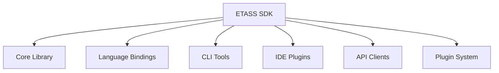

# ETASS SDK — Developer Toolkit

## 🛠️ Overview

The ETASS Software Development Kit provides comprehensive tools, libraries, and interfaces for developers to interact with the ETASS platform. The SDK enables specification authoring, compilation, execution, monitoring, and evolution through programmatic interfaces and command-line tools.

## 🎯 Objectives

### Primary Objectives

1. **Comprehensive Coverage**: Provide interfaces for all ETASS components
2. **Developer Productivity**: Enable efficient specification-driven development
3. **Platform Integration**: Support multiple programming languages and environments
4. **Extensibility**: Allow custom extensions and plugins
5. **Consistency**: Maintain uniform behavior across all interfaces

### Secondary Objectives

1. **Performance**: Optimize SDK operations for speed and efficiency
2. **Reliability**: Ensure robust error handling and recovery
3. **Security**: Implement secure authentication and authorization
4. **Documentation**: Provide comprehensive API documentation
5. **Community**: Foster ecosystem growth through open SDK

## 🏗️ SDK Architecture



## 📦 Core Library

### Python SDK

```python
# Core ETASS Python SDK
from etass.sdk import ETASSClient
from etass.sdk.specification import Chart
from etass.sdk.compiler import Compiler
from etass.sdk.runtime import RuntimeClient
from etass.sdk.observability import ObservabilityClient

# Initialize client
client = ETASSClient(api_key="your-api-key", endpoint="https://etass.api.example.com", environment="production")

# Create and compile specification
chart = Chart.load("path/to/chart")
compiled = client.compiler.compile(chart)

# Execute specification
execution = client.runtime.execute(compiled)

# Monitor execution
observability = client.observability.monitor(execution.id)
```

### SDK Components

```yaml
# SDK component structure
sdk:
  core:
    - specification: Chart loading and manipulation
    - compiler: Prompt compilation services
    - runtime: Execution management
    - observability: Monitoring and analytics
    - evolution: Continuous improvement
    - governance: Compliance and control
  
  utilities:
    - validation: Schema validation
    - serialization: Data format conversion
    - logging: SDK-specific logging
    - error_handling: Exception management
    - caching: Performance optimization
```

## 🌍 Language Bindings

### Supported Languages

| Language | Status | Features |
|----------|--------|----------|
| Python | ✅ Complete | Full SDK functionality |
| JavaScript/TypeScript | ✅ Complete | Web and Node.js support |
| Java | ✅ Complete | Enterprise integration |
| Go | ✅ Complete | Cloud-native development |
| Rust | 🏗️ Beta | Performance-critical applications |
| C# | 🏗️ Beta | .NET ecosystem |

### Language Binding Example (JavaScript)

```javascript
// ETASS JavaScript SDK
const { ETASSClient, Chart } = require('@etass/sdk');

// Initialize client
const client = new ETASSClient({
  apiKey: 'your-api-key',
  endpoint: 'https://etass.api.example.com',
  environment: 'production'
});

// Load and compile specification
async function compileAndExecute() {
  try {
    const chart = await Chart.load('path/to/chart');
    const compiled = await client.compiler.compile(chart);
    const execution = await client.runtime.execute(compiled);
    
    // Monitor progress
    const observability = client.observability.monitor(execution.id);
    observability.on('status', (status) => {
      console.log(`Execution status: ${status}`);
    });
    
    return execution;
  } catch (error) {
    console.error('Execution failed:', error);
    throw error;
  }
}
```

## 💻 CLI Tools

### Command-Line Interface

```bash
# ETASS CLI usage examples

# Initialize new project
etass init my-project --type microservice --language python

# Compile specification
etass compile path/to/chart --output compiled-prompts/

# Execute specification
etass execute compiled-prompts/ --environment production

# Monitor execution
etass monitor execution-id-123 --follow

# Validate specification
etass validate path/to/chart --strict

# Generate documentation
etass docs path/to/chart --output docs/

# Package specification for deployment
etass package path/to/chart --version 1.0.0 --output package.tar.gz
```

### CLI Architecture

```yaml
# CLI structure
cli:
  commands:
    - init: Project initialization
    - compile: Specification compilation
    - execute: Runtime execution
    - monitor: Observability and monitoring
    - validate: Specification validation
    - test: Verification and testing
    - package: Deployment packaging
    - deploy: System deployment
    - docs: Documentation generation
    - version: Version management
    - config: Configuration management
  
  features:
    - autocomplete: Shell completion
    - color_output: ANSI color support
    - json_output: Machine-readable output
    - interactive_mode: REPL interface
    - plugin_system: Extensible commands
```

## 🔌 IDE Plugins

### Supported IDEs

| IDE | Status | Features |
|-----|--------|----------|
| Visual Studio Code | ✅ Complete | Full language support, linting, debugging |
| IntelliJ IDEA | ✅ Complete | Java/Python integration, refactoring |
| PyCharm | ✅ Complete | Python-specific features |
| WebStorm | ✅ Complete | JavaScript/TypeScript support |
| Eclipse | 🏗️ Beta | Java development |
| Sublime Text | 🏗️ Beta | Lightweight editing |

### VS Code Plugin Example

```json
// VS Code extension configuration
{
  "name": "etass-vscode",
  "displayName": "ETASS",
  "description": "ETASS specification language support",
  "version": "1.0.0",
  "engines": {
    "vscode": "^1.75.0"
  },
  "categories": ["Programming Languages"],
  "activationEvents": ["onLanguage:etass"],
  "contributes": {
    "languages": [{
      "id": "etass",
      "aliases": ["ETASS", "etass"],
      "extensions": [".etass.yaml", ".soma.yaml"],
      "configuration": "./language-configuration.json"
    }],
    "grammars": [{
      "language": "etass",
      "scopeName": "source.etass",
      "path": "./syntaxes/etass.tmLanguage.json"
    }],
    "commands": [
      {
        "command": "etass.compile",
        "title": "Compile ETASS Specification"
      },
      {
        "command": "etass.validate",
        "title": "Validate ETASS Specification"
      }
    ]
  }
}
```

## 🔗 API Clients

### REST API Client

```python
# REST API client example
from etass.sdk.api import ETASSAPIClient

# Initialize client
api = ETASSAPIClient(base_url="https://api.etass.example.com", api_key="your-api-key", timeout=30)

# Compile specification
response = api.compiler.compile(
    chart_data={"apiVersion": "etass.io/v1", "kind": "Chart", "metadata": {"name": "my-app"}},
    values={"replicaCount": 3},
)

# Check execution status
execution_status = api.runtime.get_execution("exec-123")

# Query observability data
metrics = api.observability.get_metrics(
    execution_id="exec-123",
    metric_types=["agent_performance", "quality_scores"],
    time_range={"start": "2026-01-01", "end": "2026-01-31"},
)
```

### API Endpoints

```yaml
# ETASS REST API endpoints
api:
  version: v1
  base_path: /api/v1
  
  endpoints:
    specification:
      - POST /charts/compile
      - GET /charts/{id}
      - PUT /charts/{id}
      - DELETE /charts/{id}
      - POST /charts/validate
    
    compiler:
      - POST /compile
      - GET /compile/{job_id}
      - POST /compile/cancel/{job_id}
    
    runtime:
      - POST /executions
      - GET /executions/{id}
      - POST /executions/{id}/cancel
      - GET /executions/{id}/status
      - GET /executions/{id}/logs
    
    observability:
      - GET /metrics
      - GET /metrics/{execution_id}
      - GET /logs
      - GET /traces
      - GET /evidence
      - POST /alerts
    
    evolution:
      - POST /evolution/analyze
      - GET /evolution/recommendations
      - POST /evolution/apply
      - GET /evolution/history
    
    governance:
      - POST /governance/review
      - GET /governance/status/{request_id}
      - POST /governance/approve/{request_id}
      - POST /governance/reject/{request_id}
```

## 🧩 Plugin System

### Plugin Architecture

```yaml
# Plugin system configuration
plugins:
  types:
    - compiler: Custom compilation plugins
    - validator: Additional validation rules
    - exporter: Output format extensions
    - analyzer: Custom analysis tools
    - visualizer: Additional visualization options
    - integrator: Third-party system integrations
  
  interface:
    version: 1.0
    methods:
      - initialize: Plugin initialization
      - configure: Configuration setup
      - execute: Plugin execution
      - validate: Input validation
      - cleanup: Resource cleanup
  
  discovery:
    paths: ["./plugins", "~/etass-plugins", "/usr/local/etass/plugins"]
    auto_load: true
    sandboxed: true
```

### Plugin Development Example

```python
# Custom compiler plugin example
from etass.sdk.plugins import CompilerPlugin, PluginMetadata


@PluginMetadata(
    name="custom-compiler",
    version="1.0.0",
    description="Custom compilation plugin for specialized prompts",
    author="Your Organization",
    compatibility=["etass>=1.0.0"],
)
class CustomCompilerPlugin(CompilerPlugin):
    def __init__(self, config):
        super().__init__(config)
        self.custom_rules = config.get("custom_rules", {})

    def pre_compile(self, chart, context):
        """Pre-compilation processing"""
        # Apply custom transformations
        chart = self.apply_custom_transformations(chart)
        return chart, context

    def post_compile(self, compiled, context):
        """Post-compilation processing"""
        # Add custom metadata
        compiled.metadata["custom_plugin"] = {
            "version": self.metadata.version,
            "applied_rules": list(self.custom_rules.keys()),
        }
        return compiled

    def apply_custom_transformations(self, chart):
        """Apply custom transformation rules"""
        # Implement custom logic here
        return chart


# Plugin registration
if __name__ == "__main__":
    plugin = CustomCompilerPlugin({"custom_rules": {"optimize_prompts": True, "add_debugging": False}})
    plugin.register()
```

## 📦 SDK Installation

### Installation Methods

```yaml
# Installation options
installation:
  python:
    pip: "pip install etass-sdk"
    conda: "conda install -c etass etass-sdk"
    source: "git clone https://github.com/etass/sdk-python && pip install ."
  
  javascript:
    npm: "npm install @etass/sdk"
    yarn: "yarn add @etass/sdk"
    
  java:
    maven: "<dependency><groupId>io.etass</groupId><artifactId>sdk</artifactId><version>1.0.0</version></dependency>"
    gradle: "implementation 'io.etass:sdk:1.0.0'"
  
  cli:
    homebrew: "brew install etass/tap/etass-cli"
    curl: "curl -sSL https://get.etass.io/install | bash"
    docker: "docker pull etass/cli:latest"
```

### Dependency Management

```yaml
# SDK dependencies
dependencies:
  core:
    - python: ">=3.8"
    - requests: ">=2.28.0"
    - pyyaml: ">=6.0"
    - jinja2: ">=3.1.0"
    - typing-extensions: ">=4.0"
  
  optional:
    - observability: ["prometheus-client", "opentelemetry-sdk"]
    - testing: ["pytest", "pytest-cov"]
    - docs: ["sphinx", "furo"]
    - dev: ["black", "flake8", "mypy"]
  
  language_specific:
    javascript:
      - axios: ">=1.0.0"
      - yaml: ">=2.0.0"
      - winston: ">=3.0.0"
    
    java:
      - org.yaml:snakeyaml: ">=2.0"
      - com.fasterxml.jackson.core:jackson-databind: ">=2.13.0"
      - io.opentelemetry:opentelemetry-api: ">=1.0.0"
```

## 📚 SDK Documentation

### Documentation Structure

```yaml
# Documentation organization
docs:
  getting_started:
    - installation
    - quickstart
    - tutorials
  
  guides:
    - specification_authoring
    - compilation_strategies
    - runtime_management
    - observability_setup
    - evolution_configurations
  
  reference:
    - api_reference
    - cli_reference
    - configuration_options
    - error_codes
    - best_practices
  
  examples:
    - microservice_example
    - data_pipeline_example
    - web_application_example
    - mobile_backend_example
  
  advanced:
    - plugin_development
    - performance_tuning
    - security_configurations
    - custom_integrations
```

### Documentation Generation

```bash
# Generate SDK documentation
etass docs generate --format html --output docs/
etass docs generate --format pdf --output manual.pdf

# Serve documentation locally
etass docs serve --port 8080
```

## 🔒 Security

### Authentication

```yaml
# Authentication methods
authentication:
  methods:
    - api_key: Simple token-based authentication
    - oauth2: OAuth 2.0 with various flows
    - jwt: JSON Web Tokens
    - service_account: Machine-to-machine authentication
  
  configuration:
    api_key:
      header: "X-ETASS-API-Key"
      prefix: "Bearer"
      
    oauth2:
      flows: [authorization_code, client_credentials, refresh_token]
      scopes: [read, write, admin, observability]
      
    jwt:
      issuer: "etass-auth.example.com"
      algorithms: [RS256, ES256]
      expiration: 3600s
```

### Security Best Practices

```python
# Secure SDK usage example
from etass.sdk import ETASSClient
from etass.sdk.security import SecurityConfig

# Configure security settings
security_config = SecurityConfig(
    ssl_verification=True,
    certificate_path="/path/to/cert.pem",
    timeout=30,
    retry_attempts=3,
    retry_delay=2,
    max_retry_delay=10,
)

# Initialize secure client
client = ETASSClient(
    api_key="your-api-key",
    endpoint="https://etass.api.example.com",
    security_config=security_config,
    environment="production",
)

# Use with context manager for automatic cleanup
with client as secure_client:
    # All operations are automatically secured
    chart = secure_client.specification.load("path/to/chart")
    compiled = secure_client.compiler.compile(chart)
```

## 📊 Performance Optimization

### SDK Performance Features

```yaml
# Performance optimization features
performance:
  caching:
    enabled: true
    ttl: 300s
    max_size: 1000
    strategies: [lru, ttl, size_based]
  
  batching:
    enabled: true
    max_batch_size: 50
    flush_interval: 100ms
  
  compression:
    enabled: true
    algorithms: [gzip, deflate, brotli]
    min_size: 1024
  
  connection_pooling:
    enabled: true
    max_connections: 100
    idle_timeout: 300s
    
  parallelism:
    max_workers: 8
    chunk_size: 10
    load_balancing: round_robin
```

### Performance Benchmarks

| Operation | Latency (ms) | Throughput (ops/sec) |
|-----------|--------------|-----------------------|
| Chart Loading | < 50 | 1000+ |
| Compilation | < 500 | 200+ |
| Execution Start | < 200 | 500+ |
| Metrics Query | < 100 | 1000+ |
| Log Retrieval | < 300 | 300+ |

## 🤝 Integration Patterns

### CI/CD Integration

```yaml
# GitHub Actions example
name: ETASS CI/CD

on: [push, pull_request]

jobs:
  validate:
    runs-on: ubuntu-latest
    steps:
      - uses: actions/checkout@v3
      - uses: actions/setup-python@v4
        with:
          python-version: '3.10'
      
      - name: Install ETASS SDK
        run: pip install etass-sdk
      
      - name: Validate specifications
        run: etass validate charts/ --strict
      
      - name: Compile specifications
        run: etass compile charts/ --output compiled/
      
      - name: Run tests
        run: etass test compiled/ --coverage 90

  deploy:
    needs: validate
    if: github.ref == 'refs/heads/main'
    runs-on: ubuntu-latest
    steps:
      - uses: actions/checkout@v3
      - uses: actions/setup-python@v4
        
      - name: Install ETASS SDK
        run: pip install etass-sdk
      
      - name: Deploy to staging
        run: etass deploy compiled/ --environment staging
        env:
          ETASS_API_KEY: ${{ secrets.ETASS_API_KEY }}
      
      - name: Run integration tests
        run: etass test integration/ --environment staging
      
      - name: Deploy to production
        if: success()
        run: etass deploy compiled/ --environment production
        env:
          ETASS_API_KEY: ${{ secrets.ETASS_API_KEY }}
```

### IDE Integration

```json
// VS Code tasks.json example
{
  "version": "2.0.0",
  "tasks": [
    {
      "label": "Compile ETASS Specification",
      "type": "shell",
      "command": "etass",
      "args": [
        "compile",
        "${workspaceFolder}/charts",
        "--output",
        "${workspaceFolder}/compiled",
        "--verbose"
      ],
      "group": {
        "kind": "build",
        "isDefault": true
      },
      "problemMatcher": ["$etass-compiler"]
    },
    {
      "label": "Validate ETASS Specification",
      "type": "shell",
      "command": "etass",
      "args": [
        "validate",
        "${workspaceFolder}/charts",
        "--strict"
      ],
      "group": "test",
      "problemMatcher": ["$etass-validator"]
    },
    {
      "label": "Execute ETASS Specification",
      "type": "shell",
      "command": "etass",
      "args": [
        "execute",
        "${workspaceFolder}/compiled",
        "--environment",
        "development",
        "--monitor"
      ],
      "dependsOn": ["Compile ETASS Specification", "Validate ETASS Specification"]
    }
  ]
}
```

## 🎓 Training and Resources

### Learning Resources

```yaml
# Training resources
resources:
  tutorials:
    - title: "Getting Started with ETASS"
      duration: 30min
      format: interactive
      
    - title: "Advanced Specification Patterns"
      duration: 60min
      format: video
      
    - title: "Building Custom Plugins"
      duration: 45min
      format: workshop
  
  documentation:
    - user_guide: Comprehensive usage documentation
    - api_reference: Detailed API documentation
    - architecture: System architecture overview
    - best_practices: Recommended patterns
  
  community:
    - forum: "https://community.etass.io"
    - slack: "https://etass.slack.com"
    - github: "https://github.com/etass"
    - stack_overflow: "https://stackoverflow.com/questions/tagged/etass"
  
  support:
    - email: "support@etass.io"
    - chat: Live support during business hours
    - enterprise: Dedicated support contracts
```

### Certification Program

```yaml
# Certification levels
certification:
  levels:
    - associate:
        name: "ETASS Certified Developer"
        requirements: [basic_exam, project_submission]
        validity: 2years
        
    - professional:
        name: "ETASS Certified Architect"
        requirements: [advanced_exam, architecture_review, interview]
        validity: 2years
        
    - expert:
        name: "ETASS Certified Expert"
        requirements: [expert_exam, reference_project, presentation]
        validity: 3years
  
  exams:
    - basic: [specification_basics, sdk_usage, cli_tools]
    - advanced: [architecture, plugins, integrations]
    - expert: [system_design, performance, security]
```

## 📋 Success Criteria

### Implementation Success

✅ **Comprehensive Coverage**: All ETASS components accessible via SDK
✅ **Multi-Language Support**: Python, JavaScript, Java, Go implementations
✅ **CLI Tools**: Full command-line interface for all operations
✅ **IDE Integration**: VS Code, IntelliJ, and other IDE plugins
✅ **Plugin System**: Extensible architecture for custom functionality
✅ **Documentation**: Complete API reference and tutorials
✅ **Security**: Robust authentication and authorization
✅ **Performance**: Optimized for production use

### Developer Success

✅ **Productivity**: 50% reduction in development time
✅ **Adoption**: 80% of developers using SDK within 6 months
✅ **Satisfaction**: 90% positive feedback on developer experience
✅ **Ecosystem Growth**: 50+ community plugins within 12 months
✅ **Integration**: Seamless CI/CD pipeline integration
✅ **Learning Curve**: < 2 hours to basic proficiency

## 🎯 Conclusion

The ETASS SDK provides a comprehensive developer toolkit that enables efficient interaction with all aspects of the ETASS platform. From specification authoring to execution monitoring and continuous improvement, the SDK offers programmatic interfaces, command-line tools, and IDE integrations that empower developers to leverage specification-driven development effectively.

By providing consistent, well-documented interfaces across multiple programming languages, the SDK ensures that ETASS can be integrated into diverse development environments and workflows. The extensible plugin system and comprehensive documentation foster ecosystem growth and community engagement, making ETASS accessible to developers of all skill levels.

The SDK represents the primary interface through which developers interact with ETASS, making it a critical component for the platform's success and adoption. Its design emphasizes developer productivity, platform consistency, and operational reliability, ensuring that specification-driven development becomes a practical reality for engineering teams.